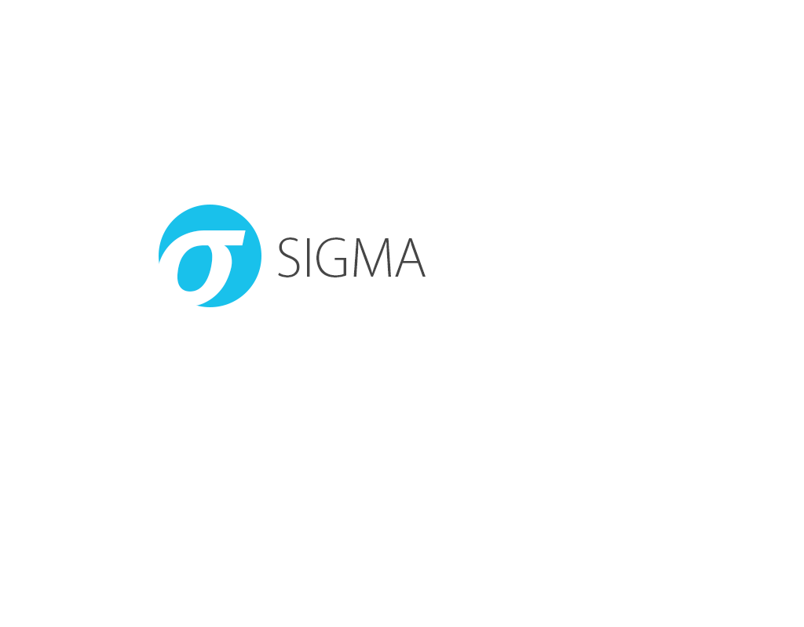
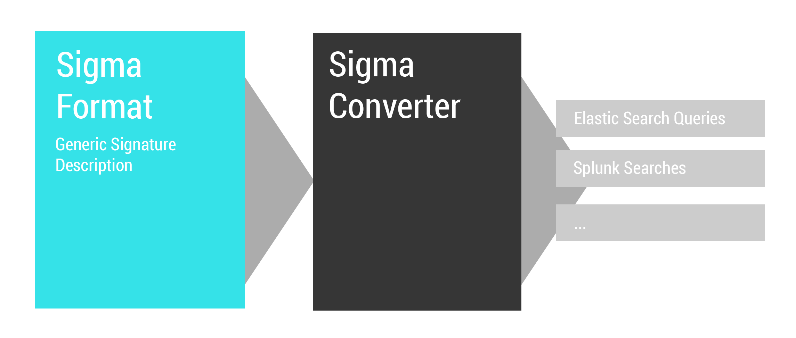
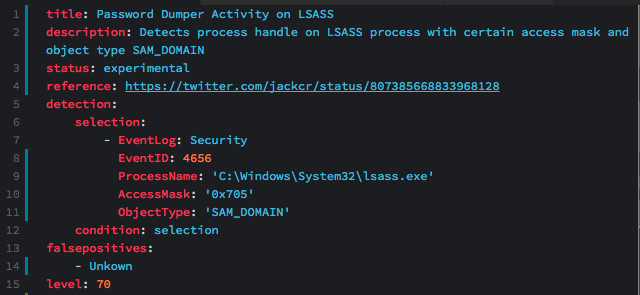
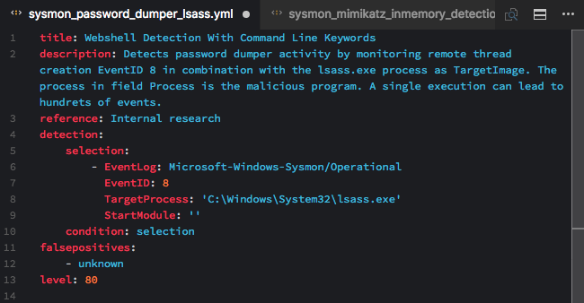
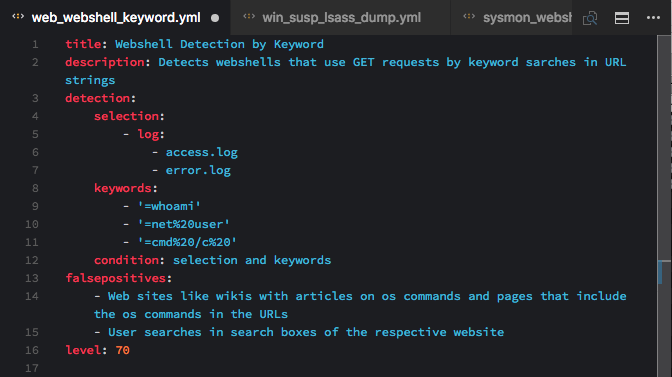
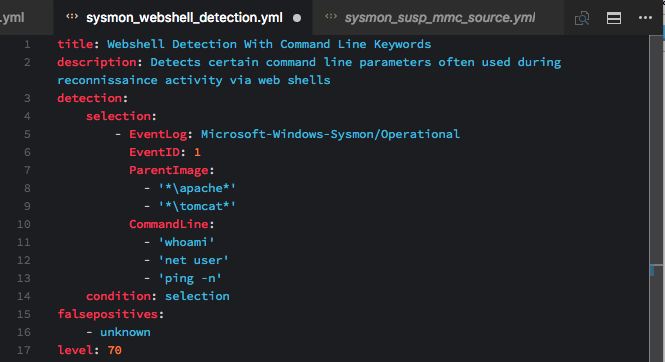
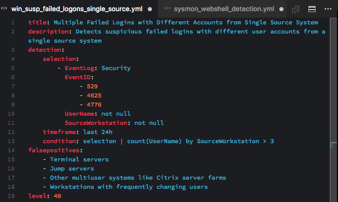
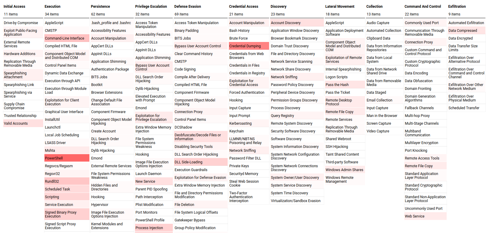
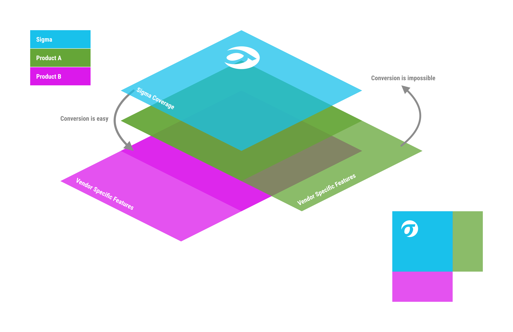

[](https://travis-ci.org/Neo23x0/sigma)



# Sigma

Generic Signature Format for SIEM Systems

# What is Sigma

Sigma is a generic and open signature format that allows you to describe relevant log events in a straightforward manner. The rule format is very flexible, easy to write and applicable to any type of log file. The main purpose of this project is to provide a structured form in which researchers or analysts can describe their once developed detection methods and make them shareable with others.

Sigma is for log files what [Snort](https://www.snort.org/) is for network traffic and [YARA](https://github.com/VirusTotal/yara) is for files.

This repository contains:

1. Sigma rule specification in the [Wiki](https://github.com/Neo23x0/sigma/wiki/Specification)
2. Open repository for sigma signatures in the `./rules` subfolder
3. A converter named `sigmac` located in the `./tools/` sub folder that generates search queries for different SIEM systems from Sigma rules



## Hack.lu 2017 Talk

[](https://www.youtube.com/watch?v=OheVuE9Ifhs "Sigma - Generic Signatures for Log Events")

## SANS Webcast on MITRE ATT&CK® and Sigma

The SANS webcast on Sigma contains a very good 20 min introduction to the project by John Hubbart from minute 39 onward. (SANS account required; registration is free)

[MITRE ATT&CK® and Sigma Alerting Webcast Recording](https://www.sans.org/webcasts/mitre-att-ck-sigma-alerting-110010 "MITRE ATT&CK® and Sigma Alerting")

# Use Cases

* Describe your detection method in Sigma to make it shareable
* Write your SIEM searches in Sigma to avoid a vendor lock-in
* Share the signature in the appendix of your analysis along with IOCs and YARA rules
* Share the signature in threat intel communities - e.g. via MISP
* Provide Sigma signatures for malicious behaviour in your own application

# Why Sigma

Today, everyone collects log data for analysis. People start working on their own, processing numerous white papers, blog posts and log analysis guidelines, extracting the necessary information and build their own searches and dashboard. Some of their searches and correlations are great and very useful but they lack a standardized format in which they can share their work with others.

Others provide excellent analyses, include IOCs and YARA rules to detect the malicious files and network connections, but have no way to describe a specific or generic detection method in log events. Sigma is meant to be an open standard in which such detection mechanisms can be defined, shared and collected in order to improve the detection capabilities for everyone.

## Slides

See the first slide deck that I prepared for a private conference in mid January 2017.

[Sigma - Make Security Monitoring Great Again](https://www.slideshare.net/secret/gvgxeXoKblXRcA)

# Specification

The specifications can be found in the [Wiki](https://github.com/Neo23x0/sigma/wiki/Specification).

The current specification is a proposal. Feedback is requested.

# Getting Started

## Rule Creation

Florian wrote a short [rule creation tutorial](https://www.nextron-systems.com/2018/02/10/write-sigma-rules/) that can help you getting started.

## Rule Usage

1. Download or clone the repository
2. Check the `./rules` sub directory for an overview on the rule base
3. Run `python sigmac --help` in folder `./tools` to get a help on the rule converter
4. Convert a rule of your choice with `sigmac` like `./sigmac -t splunk -c tools/config/generic/sysmon.yml ./rules/windows/process_creation/win_susp_whoami.yml`
5. Convert a whole rule directory with `python sigmac -t splunk -r ../rules/proxy/`
6. Check the `./tools/config` folder and the [wiki](https://github.com/Neo23x0/sigma/wiki/Converter-Tool-Sigmac) if you need custom field or log source mappings in your environment

## Troubles / Troubleshooting / Help

If you need help for a specific supported backend you can use e.g. `sigmac --backend-help elastalert-dsl`. More details on the usage of `sigmac` can be found in the dedicated [README.md](https://github.com/Neo23x0/sigma/blob/master/tools/README.md).

Be sure to checkout the [guidance on backend specific settings](https://github.com/Neo23x0/sigma/blob/master/tools/README.md#choosing-the-right-sigmac) for `sigmac`.

# Examples

Windows 'Security' Eventlog: Access to LSASS Process with Certain Access Mask / Object Type (experimental)


Sysmon: Remote Thread Creation in LSASS Process


Web Server Access Logs: Web Shell Detection


Sysmon: Web Shell Detection


Windows 'Security' Eventlog: Suspicious Number of Failed Logons from a Single Source Workstation


# Sigma Tools

## Sigmac

Sigmac converts sigma rules into queries or inputs of the supported targets listed below. It acts as a frontend to the
Sigma library that may be used to integrate Sigma support in other projects. Further, there's `merge_sigma.py` which
merges multiple YAML documents of a Sigma rule collection into simple Sigma rules.

### Usage

```bash
usage: sigmac [-h] [--recurse] [--filter FILTER]
              [--target {sqlite,netwitness-epl,logpoint,graylog,netwitness,arcsight,carbonblack,es-rule,ala,elastalert-dsl,splunkxml,fieldlist,sysmon,arcsight-esm,kibana,csharp,qualys,powershell,es-qs,mdatp,humio,grep,qradar,logiq,sql,sumologic,ala-rule,limacharlie,elastalert,splunk,stix,xpack-watcher,crowdstrike,es-dsl,ee-outliers}]
              [--target-list] [--config CONFIG] [--output OUTPUT]
              [--backend-option BACKEND_OPTION] [--defer-abort]
              [--ignore-backend-errors] [--verbose] [--debug]
              [inputs [inputs ...]]

Convert Sigma rules into SIEM signatures.

positional arguments:
  inputs                Sigma input files ('-' for stdin)

optional arguments:
  -h, --help            show this help message and exit
  --recurse, -r         Use directory as input (recurse into subdirectories is
                        not implemented yet)
  --filter FILTER, -f FILTER
                        Define comma-separated filters that must match (AND-
                        linked) to rule to be processed. Valid filters:
                        level<=x, level>=x, level=x, status=y, logsource=z,
                        tag=t. x is one of: low, medium, high, critical. y is
                        one of: experimental, testing, stable. z is a word
                        appearing in an arbitrary log source attribute. t is a
                        tag that must appear in the rules tag list, case-
                        insensitive matching. Multiple log source
                        specifications are AND linked.
  --target {arcsight,es-qs,es-dsl,kibana,xpack-watcher,elastalert,graylog,limacharlie,logpoint,grep,netwitness,powershell,qradar,qualys,splunk,splunkxml,sumologic,fieldlist,mdatp,devo}, -t {arcsight,es-qs,es-dsl,kibana,xpack-watcher,elastalert,graylog,limacharlie,logpoint,grep,netwitness,powershell,qradar,qualys,splunk,splunkxml,sumologic,fieldlist,mdatp,devo}
                        Output target format
  --target-list, -l     List available output target formats
  --config CONFIG, -c CONFIG
                        Configurations with field name and index mapping for
                        target environment. Multiple configurations are merged
                        into one. Last config is authoritative in case of
                        conflicts.
  --output OUTPUT, -o OUTPUT
                        Output file or filename prefix if multiple files are
                        generated
  --backend-option BACKEND_OPTION, -O BACKEND_OPTION
                        Options and switches that are passed to the backend
  --defer-abort, -d     Don't abort on parse or conversion errors, proceed
                        with next rule. The exit code from the last error is
                        returned
  --ignore-backend-errors, -I
                        Only return error codes for parse errors and ignore
                        errors for rules that cause backend errors. Useful,
                        when you want to get as much queries as possible.
  --verbose, -v         Be verbose
  --debug, -D           Debugging output
```

### Examples

#### Single Rule Translation
Translate a single rule
```
tools/sigmac -t splunk -c splunk-windows rules/windows/sysmon/sysmon_susp_image_load.yml
```
#### Rule Set Translation
Translate a whole rule directory and ignore backend errors (`-I`) in rule conversion for the selected backend (`-t splunk`)
```
tools/sigmac -I -t splunk -c splunk-windows -r rules/windows/sysmon/
```
#### Translate Only Rules of Level High or Critical
Translate a whole rule directory and ignore backend errors (`-I`) in rule conversion for the selected backend (`-t splunk`) and select only rules of level `high` and `critical`
```
tools/sigmac -I -t splunk -c splunk-windows -f 'level>=high' -r rules/windows/sysmon/
```
#### Rule Set Translation with Custom Config
Apply your own config file (`-c ~/my-elk-winlogbeat.yml`) during conversion, which can contain you custom field and source mappings
```
tools/sigmac -t es-qs -c ~/my-elk-winlogbeat.yml -r rules/windows/sysmon
```
#### Generic Rule Set Translation
Use a config file for `process_creation` rules (`-r rules/windows/process_creation`) that instructs sigmac to create queries for a Sysmon log source (`-c tools/config/generic/sysmon.yml`) and the ElasticSearch target backend (`-t es-qs`)
```
tools/sigmac -t es-qs -c tools/config/generic/sysmon.yml -r rules/windows/process_creation
```
#### Generic Rule Set Translation with Custom Config
Use a config file for a single `process_creation` rule (`./rules/windows/process_creation/win_susp_outlook.yml`) that instructs sigmac to create queries for process creation events generated in the Windows Security Eventlog (`-c tools/config/generic/windows-audit.yml`) and a Splunk target backend (`-t splunk`)
```
tools/sigmac -t splunk -c ~/my-splunk-mapping.yml -c tools/config/generic/windows-audit.yml ./rules/windows/process_creation/win_susp_outlook.yml
```
(See @blubbfiction's [blog post](https://patzke.org/a-guide-to-generic-log-sources-in-sigma.html) for more information)

### Supported Targets

* [Splunk](https://www.splunk.com/) (plainqueries and dashboards)
* [ElasticSearch Query Strings](https://www.elastic.co/)
* [ElasticSearch Query DSL](https://www.elastic.co/guide/en/elasticsearch/reference/current/query-dsl.html)
* [Kibana](https://www.elastic.co/de/products/kibana)
* [Elastic X-Pack Watcher](https://www.elastic.co/guide/en/x-pack/current/xpack-alerting.html)
* [Logpoint](https://www.logpoint.com)
* [Microsoft Defender Advanced Threat Protection (MDATP)](https://www.microsoft.com/en-us/microsoft-365/windows/microsoft-defender-atp)
* [Azure Sentinel / Azure Log Analytics](https://azure.microsoft.com/en-us/services/azure-sentinel/)
* [Sumologic](https://www.sumologic.com/)
* [ArcSight](https://software.microfocus.com/en-us/products/siem-security-information-event-management/overview)
* [QRadar](https://www.ibm.com/de-de/marketplace/ibm-qradar-siem)
* [Qualys](https://www.qualys.com/apps/threat-protection/)
* [RSA NetWitness](https://www.rsa.com/en-us/products/threat-detection-response)
* [PowerShell](https://docs.microsoft.com/en-us/powershell/scripting/getting-started/getting-started-with-windows-powershell?view=powershell-6)
* [Grep](https://www.gnu.org/software/grep/manual/grep.html) with Perl-compatible regular expression support
* [LimaCharlie](https://limacharlie.io)
* [ee-outliers](https://github.com/NVISO-BE/ee-outliers)
* [Structured Threat Information Expression (STIX)](https://oasis-open.github.io/cti-documentation/stix/intro.html)
* [LOGIQ](https://www.logiq.ai)
* [uberAgent ESA](https://uberagent.com/)
* [Devo](https://devo.com)

Current work-in-progress
* [Splunk Data Models](https://docs.splunk.com/Documentation/Splunk/7.1.0/Knowledge/Aboutdatamodels)

New targets are continuously developed. You can get a list of supported targets with `sigmac --lists` or `sigmac -l`.

### Requirements

The usage of Sigmac (the Sigma Rule Converter) or the underlying library requires Python >= 3.5 and PyYAML.

### Installation

It's available on PyPI. Install with:

```bash
pip3 install sigmatools
```

Alternatively, if used from the Sigma Github repository, the Python dependencies can be installed with [Pipenv](https://pypi.org/project/pipenv/).
Run the following command to get a shell with the installed requirements:

```bash
pipenv shell
```

For development (e.g. execution of integration tests with `make` and packaging), further dependencies are required and can be installed with:

```bash
pipenv install --dev
pipenv shell
```

## Sigma2MISP

Import Sigma rules to MISP events. Depends on PyMISP.

Parameters that aren't changed frequently (`--url`, `--key`) can be put without the prefixing dashes `--` into a file
and included with `@filename` as parameter on the command line.

Example:
*misp.conf*:
```
url https://host
key foobarfoobarfoobarfoobarfoobarfoobarfoo
```

Load Sigma rule into MISP event 1234:
```
sigma2misp @misp.conf --event 1234 sigma_rule.py
```

Load Sigma rules in directory sigma_rules/ into one newly created MISP event with info set to *Test Event*:
```
sigma2misp @misp.conf --same-event --info "Test Event" -r sigma_rules/
```

## Evt2Sigma

[Evt2Sigma](https://github.com/Neo23x0/evt2sigma) helps you with the rule creation. It generates a Sigma rule from a log entry.

## Sigma2attack

Generates a [MITRE ATT&CK® Navigator](https://github.com/mitre/attack-navigator/) heatmap from a directory containing sigma rules.

Requirements:
- Sigma rules tagged with a `attack.tXXXX` tag (e.g.: `attack.t1086`)

Usage samples:

```
# Use the default "rules" folder
./tools/sigma2attack

# ... or specify your own
./tools/sigma2attack --rules-directory ~/hunting/rules
```

Result once imported in the MITRE ATT&CK® Navigator ([online version](https://mitre-attack.github.io/attack-navigator/enterprise/)):



## S2AN

Similar to **Sigma2attack**, [S2AN](https://github.com/3CORESec/S2AN) is a pre-compiled binary for both Windows and GNU/Linux that generates [MITRE ATT&CK® Navigator](https://github.com/mitre/attack-navigator/) layers from a directory of Sigma rules.

S2AN was developed to be used as a standalone tool or as part of a CI/CD pipeline where it can be quickly downloaded and executed without external dependencies.

## Contributed Scripts

The directory `contrib` contains scripts that were contributed by the community:

* `sigma2elastalert.py`i by David Routin: A script that converts Sigma rules to Elastalert configurations. This tool
  uses *sigmac* and expects it in its path.

These tools are not part of the main toolchain and maintained separately by their authors.

# Next Steps

* Integration of MITRE ATT&CK® framework identifier to the rule set
* Integration into Threat Intel Exchanges
* Attempts to convince others to use the rule format in their reports, threat feeds, blog posts, threat sharing platforms

# Projects or Products that use Sigma

* [MISP](http://www.misp-project.org/2017/03/26/MISP.2.4.70.released.html) (since version 2.4.70, March 2017)
* [SOC Prime - Sigma Rule Editor](https://tdm.socprime.com/sigma/)
* [uncoder.io](https://uncoder.io/) - Online Translator for SIEM Searches
* [THOR](https://www.nextron-systems.com/2018/06/28/spark-applies-sigma-rules-in-eventlog-scan/) - Scan with Sigma rules on endpoints
* [Joe Sandbox](https://www.joesecurity.org/)
* [ypsilon](https://github.com/P4T12ICK/ypsilon) - Automated Use Case Testing
* [RANK VASA](https://globenewswire.com/news-release/2019/03/04/1745907/0/en/RANK-Software-to-Help-MSSPs-Scale-Cybersecurity-Offerings.html)
* [TA-Sigma-Searches](https://github.com/dstaulcu/TA-Sigma-Searches) (Splunk App)
* [TimeSketch](https://github.com/google/timesketch/commit/0c6c4b65a6c0f2051d074e87bbb2da2424fa6c35)
* [SIΣGMA](https://github.com/3CORESec/SIEGMA) - SIEM consumable generator that utilizes Sigma for query conversion

Sigma is available in some Linux distribution repositories:

[](https://repology.org/project/sigma/versions)

# Contribution

If you want to contribute, you are more then welcome. There are numerous ways to help this project.

## Use it and provide feedback

If you use it, let us know what works and what does not work.

E.g.
- Tell us about false positives (issues section)
- Try to provide an improved rule (new filter) via [pull request](https://help.github.com/en/articles/editing-files-in-another-users-repository) on that rule

## Work on open issues

The github issue tracker is a good place to start tackling some issues others raised to the project. It could be as easy as a review of the documentation.

## Provide Backends / Backend Features / Bugfixes

Various requests for sigmac (sigma converter) backends exist. Some backends are very limited and need features. We are working on a documentation on how to write new backends but our time for this project is currently mostly spent for issue resolutions.

## Spread the word

Last but not least, the more people use Sigma, the better, so help promote it by sharing it via social media. If you are using it, consider giving a talk about your journey and tell us about it.

# Licenses

The content of this repository is released under the following licenses:

* The toolchain (everything under `tools/`) is licensed under the [GNU Lesser General Public License](https://www.gnu.org/licenses/lgpl-3.0.en.html).
* The [Sigma specification](https://github.com/Neo23x0/sigma/wiki) is public domain.
* Everything else, especially the rules contained in the `rules/` directory is released under the [Detection Rule License (DRL) 1.0](https://github.com/Neo23x0/sigma/blob/master/LICENSE.Detection.Rules.md).

# Credits

This is a private project mainly developed by Florian Roth and Thomas Patzke with feedback from many fellow analysts and friends. Rules are our own or have been drived from blog posts, tweets or other public sources that are referenced in the rules.

# Info Graphic

## Overview


## Coverage Illustration

