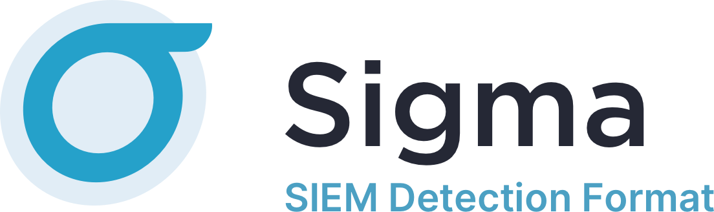
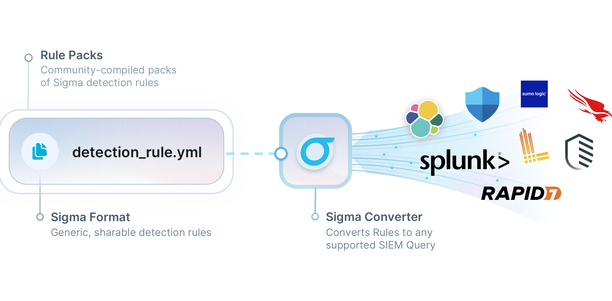

# Sigma - Generic Signature Format for SIEM Systems

<a href="https://sigmahq.io/">

 
<picture>
  <source media="(prefers-color-scheme: dark)" srcset="./images/sigma_logo_dark.png">
  
</picture>

</a>
 

  

 

Welcome to the Sigma main rule repository. The place where detection engineers, threat hunters and all defensive security practitioners collaborate on detection rules. The repository offers more than 3000 detection rules of different type and aims to make reliable detections accessible to all at no cost.

Currently the repository offers three types of rules:

* [Generic Detection Rules](./rules/) - Are threat agnostic, their aim is to detect a behavior or an implementation of a technique or procedure that was, can or will be used by a potential threat actor.
* [Threat Hunting Rules](./rules-threat-hunting/) - Are broader in scope and are meant to give the analyst a starting point to hunt for potential suspicious or malicious activity
* [Emerging Threat Rules](./rules-emerging-threats/) - Are rules that cover specific threats, that are timely and relevant for certain periods of time. These threats include specific APT campaigns, exploitation of Zero-Day vulnerabilities, specific malware used during an attack,...etc.

## Explore Sigma

To start exploring the Sigma ecosystem, please visit the official website [sigmahq.io](https://sigmahq.io)

### What is Sigma

Sigma is a generic and open signature format that allows you to describe relevant log events in a straightforward manner. The rule format is very flexible, easy to write and applicable to any type of log file.

The main purpose of this project is to provide a structured form in which researchers or analysts can describe their once developed detection methods and make them shareable with others.

Sigma is for log files what [Snort](https://www.snort.org/) is for network traffic and [YARA](https://github.com/VirusTotal/yara) is for files.

<picture>
  <source media="(prefers-color-scheme: dark)" srcset="./images/Sigma_description_dark.png">
  
</picture>

### Why Sigma

Today, everyone collects log data for analysis. People start working on their own, processing numerous white papers, blog posts and log analysis guidelines, extracting the necessary information and build their own searches and dashboard. Some of their searches and correlations are great and very useful but they lack a standardized format in which they can share their work with others.

Others provide excellent analyses, include IOCs and YARA rules to detect the malicious files and network connections, but have no way to describe a specific or generic detection method in log events. Sigma is meant to be an open standard in which such detection mechanisms can be defined, shared and collected in order to improve the detection capabilities for everyone.

### 🌟 Key Features

* A continuously growing list of detection and hunting rules, peer reviewed by a community of professional Detection Engineers.
* Vendor agnostic detection rules.
* Easily shareable across communities and reports

## 🏗️ Rule Creation

To start writing Sigma rules please check the following guides:

* [Rule Creation Guide](https://github.com/SigmaHQ/sigma/wiki/Rule-Creation-Guide)
* [How to Write Sigma Rules - Nextron Systems](https://www.nextron-systems.com/2018/02/10/write-sigma-rules/)

## 🔎 Contributing & Making PRs

Please refer to the [CONTRIBUTING](./CONTRIBUTING.md) guide for detailed instructions on how you can start contributing new rules.

## 📦 Rule Packages

You can download the latest rule packages from the [release page](https://github.com/SigmaHQ/sigma/releases/latest) and start leveraging Sigma rules today.

## 🧬 Rule Usage and Conversion

* You can start converting Sigma rules today using [Sigma CLI](https://github.com/SigmaHQ/sigma-cli) or [sigconverter.io](https://sigconverter.io) the GUI interface

* To integrate Sigma rules in your own toolchain or products use [pySigma](https://github.com/SigmaHQ/pySigma).

## 🚨 Reporting False Positives or New Rule Ideas

If you find a false positive or would like to propose a new detection rule idea but do not have the time to create one, please create a new issue on the [GitHub repository](https://github.com/SigmaHQ/sigma/issues/new/choose) by selecting one of the available templates.

## 📚 Resources & Further Reading

* [Hack.lu 2017 Sigma - Generic Signatures for Log Events by Thomas Patzke](https://www.youtube.com/watch?v=OheVuE9Ifhs)
* [MITRE ATT&CK® and Sigma Alerting SANS Webcast Recording](https://www.sans.org/webcasts/mitre-att-ck-sigma-alerting-110010 "MITRE ATT&CK® and Sigma Alerting")
* [Sigma - Generic Signatures for SIEM Systems by Florian Roth](https://www.slideshare.net/secret/gvgxeXoKblXRcA)

## Projects or Products that use or integrate Sigma rules

* [alterix](https://github.com/mtnmunuklu/alterix) - Converts Sigma rules to the query language of CRYPTTECH's SIEM
* [AttackIQ](https://www.attackiq.com/2024/01/10/sigmaiq-attackiqs-latest-innovation-for-actionable-detections/) - Sigma Rules integrated in AttackIQ's platform, and [SigmAIQ](https://github.com/AttackIQ/SigmAIQ) for Sigma rule conversion and LLM apps
* [Atomic Threat Coverage](https://github.com/atc-project/atomic-threat-coverage) (Since December 2018)
* [Confluent Sigma](https://github.com/confluentinc/confluent-sigma) - Kafka Streams supported Sigma rules
* [IBM QRadar](https://community.ibm.com/community/user/security/blogs/gladys-koskas1/2023/08/02/qradar-natively-supports-sigma-for-rules-creation)
* [Impede Detection Platform](https://impede.ai/)
* [Joe Sandbox](https://www.joesecurity.org/blog/8225577975210857708)
* [LimaCharlie](https://limacharlie.io/)
* [MISP](http://www.misp-project.org/2017/03/26/MISP.2.4.70.released.html) (Since Version 2.4.70, March 2017)
* [Nextron's Aurora Agent](https://www.nextron-systems.com/aurora/)
* [Nextron's THOR Scanner](https://www.nextron-systems.com/thor/) - Scan with Sigma rules on endpoints
* [RANK VASA](https://globenewswire.com/news-release/2019/03/04/1745907/0/en/RANK-Software-to-Help-MSSPs-Scale-Cybersecurity-Offerings.html)
* [Security Onion](https://docs.securityonion.net/en/latest/sigma.html)
* [Sekoia.io XDR](https://www.sekoia.io) - XDR supporting Sigma and Sigma Correlation rules languages
* [sigma2stix](https://github.com/muchdogesec/sigma2stix) - Converts the entire SigmaHQ Ruleset into STIX 2.1 Objects.
  * A versioned archive of sigma2stix STIX 2.1 data is also available to [download here](https://github.com/muchdogesec/cti_knowledge_base_store/tree/main/sigma-rules).
* [SIΣGMA](https://github.com/3CORESec/SIEGMA) - SIEM consumable generator that utilizes Sigma for query conversion
* [SOC Prime](https://tdm.socprime.com/sigma/)
* [TA-Sigma-Searches](https://github.com/dstaulcu/TA-Sigma-Searches) (Splunk App)
* [TimeSketch](https://github.com/google/timesketch/commit/0c6c4b65a6c0f2051d074e87bbb2da2424fa6c35)
* [ypsilon](https://github.com/P4T12ICK/ypsilon) - Automated Use Case Testing

## 📜 Maintainers

* [Nasreddine Bencherchali (@nas_bench)](https://twitter.com/nas_bench)
* [Florian Roth (@cyb3rops)](https://twitter.com/cyb3rops)
* [Christian Burkard (@phantinuss)](https://twitter.com/phantinuss)
* [François Hubaut (@frack113)](https://twitter.com/frack113)
* [Thomas Patzke (@blubbfiction)](https://twitter.com/blubbfiction)

## Credits

This project would've never reached this height without the help of the hundreds of contributors. Thanks to all past and present contributors for their help.

## Licenses

The content of this repository is released under the [Detection Rule License (DRL) 1.1](https://github.com/SigmaHQ/Detection-Rule-License).
