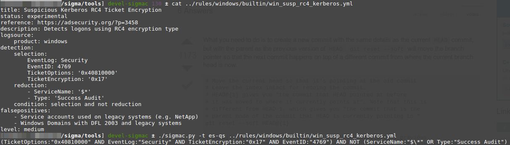

[](https://travis-ci.org/Neo23x0/sigma)


# Sigma

Generic Signature Format for SIEM Systems

# What is Sigma

Sigma is a generic and open signature format that allows you to describe relevant log events in a straight forward manner. The rule format is very flexible, easy to write and applicable to any type of log file. The main purpose of this project is to provide a structured form in which researchers or analysts can describe their once developed detection methods and make them shareable with others.

Sigma is for log files what [Snort](https://www.snort.org/) is for network traffic and [YARA](https://github.com/VirusTotal/yara) is for files.

This repository contains:

* Sigma rule specification in the [Wiki](https://github.com/Neo23x0/sigma/wiki/Specification)
* Open repository for sigma signatures in the `./rules`subfolder
* A converter that generate searches/queries for different SIEM systems [work in progress]


## Hack.lu 2017 Talk

[](https://www.youtube.com/watch?v=OheVuE9Ifhs "Sigma - Generic Signatures for Log Events")

# Use Cases

* Describe your detection method in Sigma to make it sharable
* Write and your SIEM searches in Sigma to avoid a vendor lock-in
* Share the signature in the appendix of your analysis along with IOCs and YARA rules
* Share the signature in threat intel communities - e.g. via MISP
* Provide Sigma signatures for malicious behaviour in your own application

# Why Sigma

Today, everyone collects log data for analysis. People start working on their own, processing numerous white papers, blog posts and log analysis guidelines, extracting the necessary information and build their own searches and dashboard. Some of their searches and correlations are great and very useful but they lack a standardized format in which they can share their work with others. 

Others provide excellent analyses, include IOCs and YARA rules to detect the malicious files and network connections, but have no way to describe a specific or generic detection method in log events. Sigma is meant to be an open standard in which such detection mechanisms can be defined, shared and collected in order to improve the detection capabilities for everyone. 

## Slides

See the first slide deck that I prepared for a private conference in mid January 2017.

[Sigma - Make Security Monitoring Great Again](https://www.slideshare.net/secret/gvgxeXoKblXRcA)

# Specification

The specifications can be found in the [Wiki](https://github.com/Neo23x0/sigma/wiki/Specification). 

The current specification is a proposal. Feedback is requested.

# Getting Started

## Rule Creation

Florian wrote a short [rule creation tutorial](https://www.nextron-systems.com/2018/02/10/write-sigma-rules/) that can help you getting started.

## Rule Usage 

1. Download or clone the respository
2. Check the `./rules` sub directory for an overview on the rule base
3. Run `python sigmac --help` in folder `./tools` to get a help on the rule converter
4. Convert a rule of your choice with `sigmac` like `python sigmac -t splunk ../rules/windows/builtin/win_susp_process_creations.yml`
5. Convert a whole rule directory with `python sigmac -t splunk -r ../rules/proxy/`
6. Check the `./tools/config` folder and the [wiki](https://github.com/Neo23x0/sigma/wiki/Converter-Tool-Sigmac) if you need custom field or log source mappings in your environment

# Examples

Windows 'Security' Eventlog: Access to LSASS Process with Certain Access Mask / Object Type (experimental)


Sysmon: Remote Thread Creation in LSASS Process


Web Server Access Logs: Web Shell Detection


Sysmon: Web Shell Detection


Windows 'Security' Eventlog: Suspicious Number of Failed Logons from a Single Source Workstation


# Sigma Tools 

## Sigmac 

Sigmac converts sigma rules into queries or inputs of the supported targets listed below. It acts as a frontend to the
Sigma library that may be used to integrate Sigma support in other projects. Further, there's `merge_sigma.py` which
merges multiple YAML documents of a Sigma rule collection into simple Sigma rules.



### Supported Targets

* [Splunk](https://www.splunk.com/) (plainqueries and dashboards)
* [ElasticSearch Query Strings](https://www.elastic.co/)
* [ElasticSearch Query DSL](https://www.elastic.co/guide/en/elasticsearch/reference/current/query-dsl.html)
* [Kibana](https://www.elastic.co/de/products/kibana)
* [Elastic X-Pack Watcher](https://www.elastic.co/guide/en/x-pack/current/xpack-alerting.html)
* [Logpoint](https://www.logpoint.com)
* [Windows Defender Advanced Threat Protection (WDATP)](https://www.microsoft.com/en-us/windowsforbusiness/windows-atp)
* [ArcSight](https://software.microfocus.com/en-us/products/siem-security-information-event-management/overview)
* [QRadar](https://www.ibm.com/de-de/marketplace/ibm-qradar-siem)
* [Qualys](https://www.qualys.com/apps/threat-protection/)
* Grep with Perl-compatible regular expression support

Current work-in-progress
* [Splunk Data Models](https://docs.splunk.com/Documentation/Splunk/7.1.0/Knowledge/Aboutdatamodels)

New targets are continuously developed. You can get a list of supported targets with `sigmac --target-list` or `sigmac -l`.

### Requirements

The usage of Sigmac (the Sigma Rule Converter) or the underlying library requires Python >= 3.5 and PyYAML.

### Installation

It's available on PyPI. Install with:

```bash
pip3 install sigmatools
```

Alternatively, if used from the Sigma Github repository, the Python dependencies can be installed with:

```bash
pip3 install -r tools/requirements.txt
```

For development (e.g. execution of integration tests with `make` and packaging), further dependencies are required and can be installed with:

```bash
pip3 install -r tools/requirements-devel.txt
```

## Evt2Sigma

[Evt2Sigma](https://github.com/Neo23x0/evt2sigma) helps you with the rule creation. It generates a Sigma rule from a log entry. 

## Contributed Scripts

The directory `contrib` contains scripts that were contributed by the community:

* `sigma2elastalert.py`i by David Routin: A script that converts Sigma rules to Elastalert configurations. This tool
  uses *sigmac* and expects it in its path.

These tools are not part of the main toolchain and maintained separately by their authors.

# Next Steps

* Integration of MITRE ATT&CK framework identifier to the rule set
* Integration into Threat Intel Exchanges
* Attempts to convince others to use the rule format in their reports, threat feeds, blog posts, threat sharing platforms

# Projects that use Sigma

* [MISP](http://www.misp-project.org/2017/03/26/MISP.2.4.70.released.html) (since version 2.4.70, March 2017)
* [TA-Sigma-Searches](https://github.com/dstaulcu/TA-Sigma-Searches) (Splunk App)
* [SOC Prime - Sigma Rule Editor](https://tdm.socprime.com/sigma/)
* [ypsilon](https://github.com/P4T12ICK/ypsilon) - Automated Use Case Testing 
* [SPARK](https://www.nextron-systems.com/2018/06/28/spark-applies-sigma-rules-in-eventlog-scan/) - Scan with Sigma rules on endpoints

# Licenses

The content of this repository is released under the following licenses:

* The toolchain (everything under `tools/`) is licensed under the [GNU Lesser General Public License](https://www.gnu.org/licenses/lgpl-3.0.en.html).
* The [Sigma specification](https://github.com/Neo23x0/sigma/wiki) is public domain.
* Everything else, especially the rules contained in the `rules/` directory is released under the [GNU General Public License](https://www.gnu.org/licenses/gpl-3.0.en.html).

# Credits

This is a private project mainly developed by Florian Roth and Thomas Patzke with feedback from many fellow analysts and friends. Rules are our own or have been drived from blog posts, tweets or other public sources that are referenced in the rules.

Copyright for Tree Image: [studiobarcelona / 123RF Stock Photo](http://www.123rf.com/profile_studiobarcelona)
