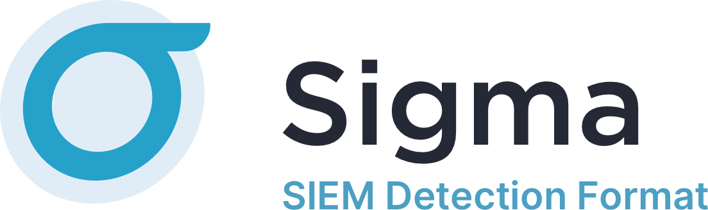
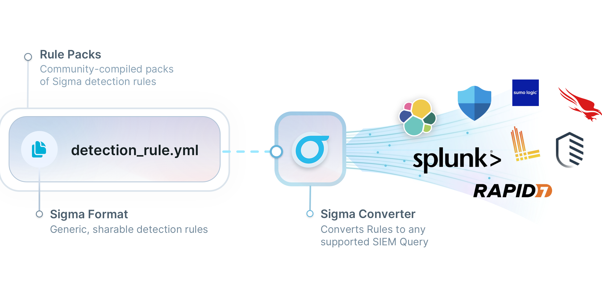

# Sigma - Generic Signature Format for SIEM Systems

<a href="https://sigmahq.io/">

 
<picture>
  <source media="(prefers-color-scheme: dark)" srcset="./images/sigma_logo_dark.png">
  
</picture>

</a>
 

  

 

Welcome to the Sigma main rule repository. The place where detection engineers, threat hunters and all defensive security practitioners collaborate on detection rules. The repository offers more than 3000 detection rules of different type and aims to make reliable detections accessible to all at no cost.

Currently the repository offers the following types of rules:

* [Generic Detection Rules](./rules/) - Are threat agnostic, their aim is to detect a behavior or an implementation of a technique or procedure that was, can or will be used by a potential threat actor.
* [Threat Hunting Rules](./rules-threat-hunting/) - Are broader in scope and are meant to give the analyst a starting point to hunt for potential suspicious or malicious activity
* [Emerging Threat Rules](./rules-emerging-threats/) - Are rules that cover specific threats, that are timely and relevant for certain periods of time. These threats include specific APT campaigns, exploitation of Zero-Day vulnerabilities, specific malware used during an attack,...etc.
* [Compliance Rules](./rules-compliance/) - Are rules that help you identify compliance violations based on well known security frameworks such as CIS Controls, NIST, ISO 27001,...etc.
* [Placeholder Rules](./rules-placeholder/) - Are rules that get their final meaning at conversion or usage time of the rule.

## Explore Sigma

To start exploring the Sigma ecosystem, please visit the official website [sigmahq.io](https://sigmahq.io)

### What is Sigma

Sigma is a generic and open signature format that allows you to describe relevant log events in a straightforward manner. The rule format is very flexible, easy to write and applicable to any type of log file.

The main purpose of this project is to provide a structured form in which researchers or analysts can describe their once developed detection methods and make them shareable with others.

Sigma is for log files what [Snort](https://www.snort.org/) is for network traffic and [YARA](https://github.com/VirusTotal/yara) is for files.

<picture>
  <source media="(prefers-color-scheme: dark)" srcset="./images/Sigma_description_dark.png">
  
</picture>

### Why Sigma

Today, everyone collects log data for analysis. People start working on their own, processing numerous white papers, blog posts and log analysis guidelines, extracting the necessary information and build their own searches and dashboard. Some of their searches and correlations are great and very useful but they lack a standardized format in which they can share their work with others.

Others provide excellent analyses, include IOCs and YARA rules to detect the malicious files and network connections, but have no way to describe a specific or generic detection method in log events. Sigma is meant to be an open standard in which such detection mechanisms can be defined, shared and collected in order to improve the detection capabilities for everyone.

### 🌟 Key Features

* A continuously growing list of detection and hunting rules, peer reviewed by a community of professional Detection Engineers.
* Vendor agnostic detection rules.
* Easily shareable across communities and reports

## 🏗️ Rule Creation

To start writing Sigma rules please check the following getting started guide along with the sigma specification:

* [Getting Started Guide](https://sigmahq.io/docs/guide/about.html)
* [Sigma Specification](https://github.com/SigmaHQ/sigma-specification/blob/main/specification/sigma-rules-specification.md)

## 🔎 Contributing & Making PRs

Please refer to the [CONTRIBUTING](./CONTRIBUTING.md) guide for detailed instructions on how you can start contributing new rules.

## 📦 Rule Packages

You can download the latest rule packages from the [release page](https://github.com/SigmaHQ/sigma/releases/latest) and start leveraging Sigma rules today. New rules are also released on a regular basis, so check back often for the latest detections.

## 🧬 Rule Usage and Conversion

* You can start converting Sigma rules today using:
  * [Sigma CLI](https://github.com/SigmaHQ/sigma-cli) - the official command-line converter
  * [sigconverter.io](https://sigconverter.io) - web-based GUI converter
  * [Detection Studio](https://detection.studio/) - web-based GUI converter

* To integrate Sigma rules in your own toolchain or products use [pySigma](https://github.com/SigmaHQ/pySigma).

## 🚨 Reporting False Positives or New Rule Ideas

If you find a false positive or would like to propose a new detection rule idea but do not have the time to create one, please create a new issue on the [GitHub repository](https://github.com/SigmaHQ/sigma/issues/new/choose) by selecting one of the available templates.

## 💬 Community

Join the Sigma community on [Discord](https://discord.gg/UcDN25s8) to discuss detection engineering, ask questions, share ideas, and collaborate with other practitioners. We also use Discord for announcements such as new releases and other project updates.

## 🌐 Official Resources

* [sigmahq.io](https://sigmahq.io/) - Official Sigma website
* [SigmaHQ Blog](https://blog.sigmahq.io/) - Official blog covering detection engineering, rule releases, and Sigma updates
* [Phoenix - Sigma Rule Intelligence Platform](https://sigma.nasbench.dev/) - Search, analyze, and understand Sigma rules mapped to MITRE ATT&CK

## 📚 Resources & Further Reading

* [Hack.lu 2017 Sigma - Generic Signatures for Log Events by Thomas Patzke](https://www.youtube.com/watch?v=OheVuE9Ifhs)
* [Sigma - Generic Signatures for SIEM Systems by Florian Roth](https://www.slideshare.net/secret/gvgxeXoKblXRcA)
* [50 Shades of Sigma by Florian Roth](https://www.slideshare.net/FlorianRoth2/50-shades-of-sigma)
* [Introducing Sigma Specification v2.0 by Nasreddine Bencherchali](https://blog.sigmahq.io/introducing-sigma-specification-v2-0-25f81a926ff0)
* [SIGMA-Resources - Curated list of resources to learn and understand Sigma rules](https://github.com/nasbench/SIGMA-Resources)
* [The Ultimate Guide to Sigma Rules by Graylog](https://graylog.org/post/the-ultimate-guide-to-sigma-rules/)
* [Introduction to Sigma Rules by Intezer](https://intezer.com/blog/threat-hunting/intro-to-sigma-rules/)

## Projects or Products that use or integrate Sigma rules
* [AlphaSOC](https://docs.alphasoc.com/detections_and_findings/sigma/introduction/) - Leverages Sigma rules to increase coverage across all supported log sources
* [alterix](https://github.com/mtnmunuklu/alterix) - Converts Sigma rules to the query language of CRYPTTECH's SIEM
* [AttackIQ](https://www.attackiq.com/2024/01/10/sigmaiq-attackiqs-latest-innovation-for-actionable-detections/) - Sigma Rules integrated in AttackIQ's platform, and [SigmAIQ](https://github.com/AttackIQ/SigmAIQ) for Sigma rule conversion and LLM apps
* [Atomic Threat Coverage](https://github.com/atc-project/atomic-threat-coverage) - Automatically maps Sigma rules to MITRE ATT&CK techniques, Atomic Red Team tests, and incident response playbooks (since December 2018)
* [ATR (Agent Threat Rules)](https://github.com/Agent-Threat-Rule/agent-threat-rules) - Open MIT-licensed detection rule format for AI agent security threats (prompt injection, tool poisoning, context exfiltration). Reference CLI exports ATR rules to Sigma format via `atr convert sigma`.
* [AttackRuleMap](https://attackrulemap.com/) - Maps Atomic Red Team attack simulations to open-source Sigma detection rules for coverage assessment
* [Confluent Sigma](https://github.com/confluentinc/confluent-sigma) - Kafka Streams supported Sigma rules
* [Detection Studio](https://detection.studio/?ref=sigmahq_readme) - Convert Sigma rules to any supported SIEM
* [Exeon.UEBA](https://exeon.com/ueba/) - User and Entity Behavior Analytics (UEBA) solution from Exeon which provides a built-in Sigma detection engine
* [IBM QRadar](https://community.ibm.com/community/user/security/blogs/gladys-koskas1/2023/08/02/qradar-natively-supports-sigma-for-rules-creation) - Natively ingests Sigma rules for real-time detection via the YARA and Sigma Rules Manager app
* [Joe Sandbox](https://www.joesecurity.org/blog/8225577975210857708) - Automated malware analysis platform that applies Sigma rules during sandbox execution to detect threats in behavioral logs
* [LimaCharlie](https://limacharlie.io/) - SecOps cloud platform with native Sigma rule support and automatic conversion to its Detection & Response rule format
* [MISP](http://www.misp-project.org/2017/03/26/MISP.2.4.70.released.html) - Open-source threat intelligence sharing platform with native Sigma rule support (since version 2.4.70, March 2017)
* [Nextron's Aurora Agent](https://www.nextron-systems.com/aurora/) - Lightweight Sigma-based EDR agent using ETW for real-time endpoint detection
* [Nextron's THOR Scanner](https://www.nextron-systems.com/thor/) - Scan with Sigma rules on endpoints
* [RANK VASA](https://globenewswire.com/news-release/2019/03/04/1745907/0/en/RANK-Software-to-Help-MSSPs-Scale-Cybersecurity-Offerings.html) - AI-based network threat detection platform that uses Sigma rules to identify security anomalies for MSSPs
* [Saeros](https://github.com/Saeros-Security/Saeros) - Open-source HIDS for Windows and Active Directory with local Sigma rule matching via ETW
* [Security Onion](https://docs.securityonion.net/en/3/main/sigma/) - Open-source network security monitoring platform with built-in Sigma detection and automatic daily rule updates
* [Sekoia.io XDR](https://www.sekoia.io) - XDR supporting Sigma and Sigma Correlation rules languages
* [sigma2stix](https://github.com/muchdogesec/sigma2stix) - Converts the entire SigmaHQ Ruleset into STIX 2.1 Objects
* [SIΣGMA](https://github.com/3CORESec/SIEGMA) - SIEM consumable generator that utilizes Sigma for query conversion
* [SOC Prime](https://my.socprime.com/sigma/) - Threat detection marketplace hosting community Sigma rules with translation to 25+ SIEM, EDR, and XDR platforms
* [TA-Sigma-Searches](https://github.com/dstaulcu/TA-Sigma-Searches) - Splunk app providing saved searches derived from converted Sigma rules
* [TimeSketch](https://github.com/google/timesketch/commit/0c6c4b65a6c0f2051d074e87bbb2da2424fa6c35) - Open-source collaborative forensic timeline analysis tool that uses Sigma rules to tag and detect events
* [VirusTotal](https://docs.virustotal.com/docs/crowdsourced-sigma-rules) - Whenever a sample matches any open-source Sigma rules, the matching rules are displayed as part of the file report
* [ypsilon](https://github.com/P4T12ICK/ypsilon) - Automated Use Case Testing

## 📜 Maintainers

* [Nasreddine Bencherchali (@nas_bench)](https://x.com/nas_bench)
* [Florian Roth (@cyb3rops)](https://x.com/cyb3rops)
* [Christian Burkard (@phantinuss)](https://x.com/phantinuss)
* [François Hubaut (@frack113)](https://x.com/frack113)
* [Thomas Patzke (@blubbfiction)](https://x.com/blubbfiction)
* [Mohamed Ashraf (@X__Junior)](https://x.com/X__Junior)
* [Swachchhanda Shrawan Poudel (@\_swachchhanda\_)](https://x.com/_swachchhanda_)

## Credits

This project would've never reached this height without the help of the hundreds of contributors. Thanks to all past and present contributors for their help.

## Licenses

The content of this repository is released under the [Detection Rule License (DRL) 1.1](https://github.com/SigmaHQ/Detection-Rule-License).
