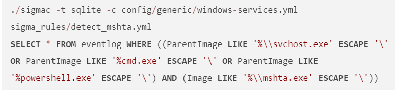
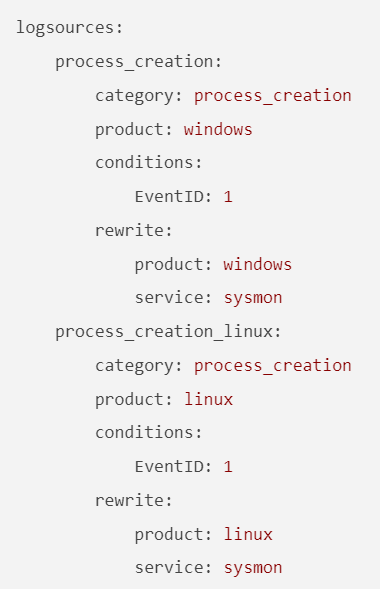
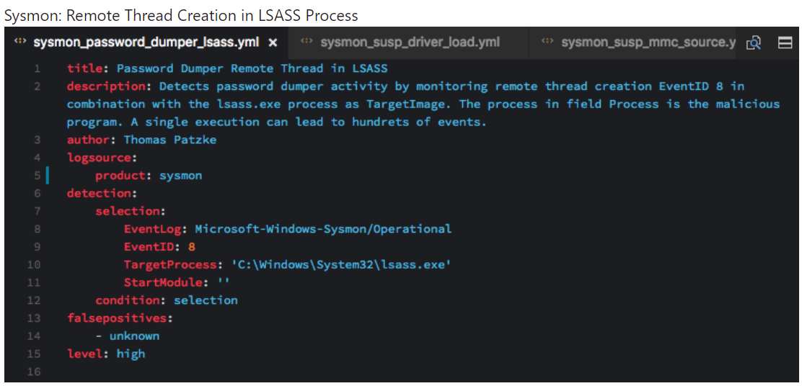
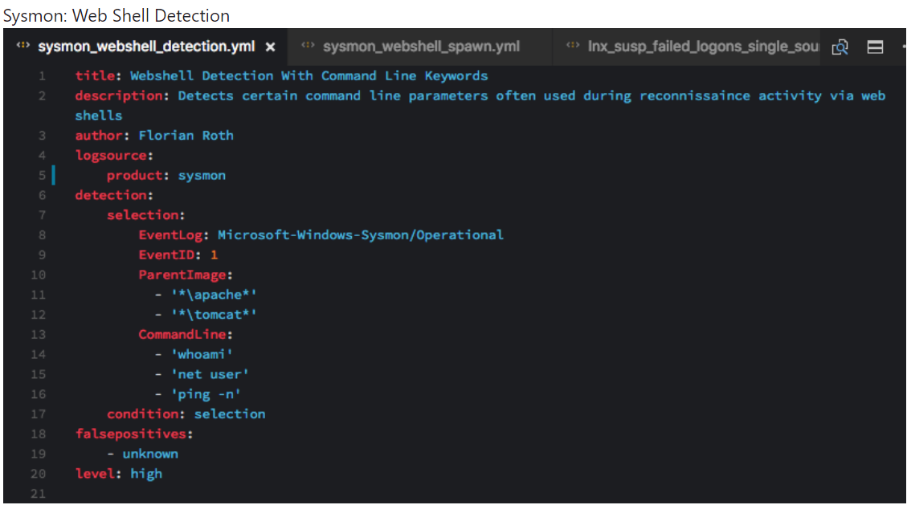
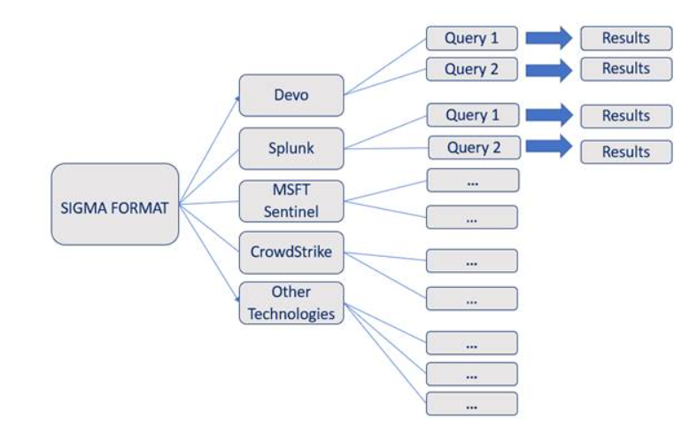
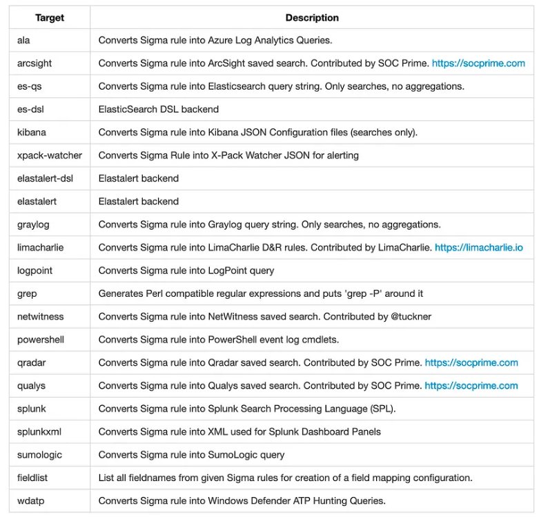
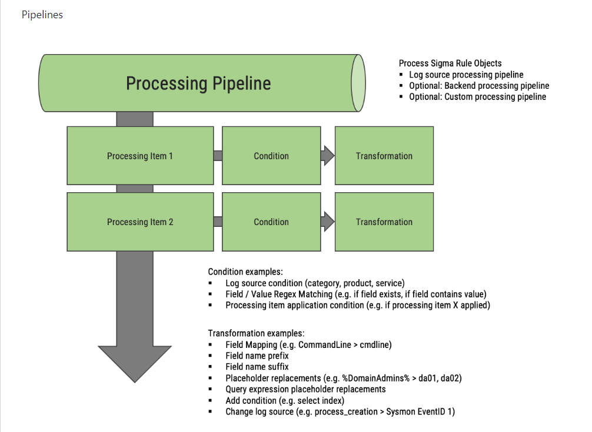

## به نام خدا 

# پروژه ی قوانین سیگما

# SIGMA RULES

# فهرست

1. [مقدمه][ref1]
   
2. [سیگما چیست؟][ref2]
   
4. [چرا از قوانین سیگما استفاده می کنیم؟][ref3]
   
5. [الگوی قوانین سیگما][ref4]
   
6. [استفاده از قوانین سیگما][ref5]
   
7. [ترجمه قوانین سیگما به زبان های دیگر][ref6]
   
8. [رابط خط فرمان ][ref7]
   
9.  [برسی کد فایل های پروژه سیگما][ref8]

استفاده_از_قوانین_سیگما

[ref1]: #مقدمه
[ref2]: #سیگماچیست؟
[ref3]: #چرا_از_قوانین_سیگما_استفاده_میکنیم
[ref4]: #الگوی_قوانین_سیگما
[ref5]: #استفاده_از_قوانین_سیگما
[ref6]: #ترجمه_قوانین_سیگما_به_زبان_های_دیگر
[ref7]: #رابط_خط_فرمان
[ref8]: #برسی_کد_فایل_های_پروژه_سیگما

# مقدمه 

نکته ها و مهارت های مربوط به قوانین  Sigmaدر تیم های (1 SOCمرکز فرماندهی امنیت) به عنوان روشی برای
نوشتن قوانینی که در چندین محیط قابل استفاده باشند، در حال گسترش است. با یادگیری نحوه کار کردن
قوانین  Sigmaو نحوه ایجاد آنها، میتوانید مهارتهای  SOCخود را به سطح بالاتری برده و عملکرد امنیتی
تیم خود را بهبود بخشید.     
تشخیص نقضهای امنیتی در زیرساخت یک سازمان به طور قوی بر تحلیل و نظارت بر رویدادها با استفاده از
لاگها متکی است. انواع مختلفی از لاگها، سیستمهای تجمیع، استراتژیها و فناوریها وجود دارند که به
تحلیلگران  SOCدر کار روزانه آنها کمک میکنند. اما وجود این تنوع از ابزارها، فرآیند به اشتراک گذاری
اطلاعات و دانش درون سازمان و جامعه را پیچیده میکند؛ هر 2 SIEMدارای دستور زبان کوئری (یا زبان) خود
و هر لاگ دارای فیلدهای منحصر به فرد خود است.     
اغلب تحلیلگران قوانینی را ایجاد میکنند تا تهدیدات فعال یا حملات را شناسایی کنند و سازمانها ممکن
است بخواهند از آنها برای هشدار دادن در صورت وقوع نقض ممکن استفاده کنند. به عنوان مثال، ممکن است
یک قانون عالی برای شناسایی ایجاد یک فرآیند مخرب خاص داشته باشیم و میخواهیم این قانون را با جامعه،
شرکا یا مشتریان به اشتراک بگذاریم. با این حال، به این دلیل که هر سازمان روش خود برای پردازش لاگها،
زیرساخت و ابزارها دارد، به اشتراک گذاری قوانین شناسایی رفتارها پیچیده است و ممکن است برای آنها
سخت باشد که این قوانین را در زیرساختهای موجود یکپارچه کنند.     
راه حل این مشکل استفاده از قوانین  Sigmaاست. این قوانین با استفاده از یک زبان نشانهگذاری در یک فرمت
خوب تعریف میشوند.  Sigmaبرای تولید کوئریها برای SIEMها و پیکربندیهای خاص استفاده میشود.
استفاده از  Sigmaبرای نوشتن قوانین شناسایی، آنها را آسانتر برای به اشتراک گذاشتن و یکپارچهسازی
آنها در سازمانها، بدون توجه به ابزارها و لاگهای خاصی که استفاده میشوند، میکند.
  
اطلاعات بیشتر:  
https://medium.com/sigma-hq/sigma-rule-repository-enhancements-new-folder-structure-rule-types-30adb70f5e10

# سیگماچیست؟ 

سیگما یک فرمت امضای عمومی و باز است که به شما امکان می دهد رویدادهای گزارش مربوطه را به روشی ساده توصیف کنید. فرمت قانون بسیار منعطف است، نوشتن آن آسان است و برای هر نوع فایل لاگ قابل استفاده است. هدف اصلی این پروژه ارائه فرمی ساختاریافته است که در آن محققان یا تحلیلگران بتوانند روش‌های تشخیص خود را که زمانی توسعه یافته بودند توصیف کرده و آنها را با دیگران به اشتراک بگذارند.   
فرمت SIGMA یکی از زبان های مشترک سیستم های امنیتی مانند EDR ها و SIEM ها میباشد. به واسطه این فرمت ما توانایی این را داریم که قوانینی را برای شناسایی تهدیدات ایجاد کنیم.

SIEM:     
SIEM یا مدیریت اطلاعات و رویدادهای امنیتی، روش جامعی است که برای مدیریت اطلاعات امنیتی و رویدادها در زیرساخت IT یک سازمان استفاده می‌شود. SIEM از دو عملکرد اساسی تشکیل شده است: مدیریت اطلاعات امنیتی (SIM) و مدیریت رویدادهای امنیتی (SEM).
SIM شامل جمع‌آوری، تحلیل و مدیریت داده‌های لاگ از منابع مختلفی مانند سرورها، دستگاه‌های شبکه، برنامه‌ها و سیستم‌های امنیتی است. این داده‌ها شامل رویدادهای امنیتی، لاگ‌های سیستم، فعالیت‌های کاربران و غیره می‌شود. هدف از این عملیات تمرکز و همبسته‌سازی این اطلاعات است تا بتوان نقاط ضعف و حوادث امنیتی محتمل را شناسایی کرد.   
SEM بر روی نظارت و تحلیل به طور لحظه‌ای رویدادهای امنیتی تمرکز دارد. این عمل شامل همبسته‌سازی و تحلیل داده‌های لاگ برای شناسایی الگوها یا ناهنجاری‌هایی است که ممکن است بر روی تهدیدها، حملات یا نفوذهای امنیتی اشاره کند. سیستم‌های SEM هنگام شناسایی فعالیت‌های مشکوک هشدارها و اعلان‌ها را تولید می‌کنند تا تیم‌های امنیتی بتوانند به سرعت واکنش نشان دهند.
با ترکیب قابلیت‌های SIM و SEM، SIEM به سازمان‌ها یک پلتفرم متمرکز برای نظارت پیشگیرانه امنیتی، شناسایی تهدیدها، پاسخگویی به حوادث و مدیریت تطابق با مقررات فراهم می‌کند. راه‌حل‌های SIEM به طور معمول قابلیت‌هایی نظیر تجمیع لاگ، همبسته‌سازی رویدادها، نظارت در زمان واقعی، یکپارچگی با اطلاعات تهدید، گزارش‌دهی و حسابرسی تطابق را ارائه می‌دهند.
در کل، SIEM با کمک تشخیص و پاسخ به حوادث امنیتی به صورت موثرتر، شناسایی آسیب‌پذیری‌های احتمالی و اطمینان از پایبندی به مقررات صنعتی، به سازمان‌ها کمک می‌کند تا سطح امنیتی خود را تقویت کنند.      	

EDR:   
EDR به معنای Endpoint Detection and Response است. این تکنولوژی و رویکرد امنیتی در حوزه سایبری به تشخیص و پاسخ به تهدیدهای پیشرفته روی انتها نقطه ها متمرکز می‌شود. انتها نقطه به دستگاه‌ها یا کلاینت‌هایی اطلاق می‌شود که به یک شبکه متصل هستند، از جمله رایانه‌های رومیزی، لپ‌تاپ‌ها، سرورها و دستگاه‌های همراه.
امنیت انتها نقطه  بر هدف‌گذاری دستگاه‌های شبکه و محافظت از آنها در برابر تهدیدهای مختلف، شامل نرم‌افزارهای مخرب، دسترسی غیرمجاز و نفوذهای داده متمرکز است. تدابیر امنیتی سنتی مانند دیواره‌های آتش  و نرم‌افزارهای ضدویروس اصولاً بر جلوگیری از نفوذ تهدیدها به محدوده شبکه تمرکز دارند، اما در برابر حملات پیچیده و هدفمند ممکن است کارایی کمتری داشته باشند.
راهکارهای EDR به صورت پیوسته، داده‌های انتها نقطه را جمع‌آوری و تحلیل می‌کنند. این داده‌ها شامل رویدادهای سیستمی، تغییرات فایل، ترافیک شبکه و رفتار کاربری است و برای شناسایی فعالیت‌های مشکوک یا مخرب مورد استفاده قرار می‌گیرند. راهکارهای EDR از روش‌های پیشرفته مانند نظارت بر رفتار، یادگیری ماشین و هوش مصنوعی استفاده می‌کنند تا به صورت پیشگیرانه تهدیدها را شناسایی و با آنها مقابله کنند.
هنگامی که تهدید یا حادثه‌ای مشکوک شناسایی می‌شود، سیستم‌های EDR قادر به تولید هشدارها، بررسی حادثه و شروع عملکردهای پاسخ می‌باشند. این عملکردها می‌تواند شامل جدا کردن انتها نقطه تخریب شده، مسدود کردن فعالیت‌های مخرب، خاتمه دادن به فرآیندهای مشکوک و حذف نرم‌افزارهای مخرب باشد. راهکارهای EDR نقش مهمی در کاهش زمان تشخیص و پاسخ به حوادث امنیتی دارند و به سازمان‌ها کمک می‌کنند تا تأثیر حملات سایبری را کاهش داده و جلوی نفوذ داده را بگیرند.
در کل، تکنولوژی‌های EDR قدرت تشخیص، بررسی و پاسخ به تهدیدهای سایبری را در انتها نقطه‌های جداگانه ارتقاء می‌بخشند و به عنوان لایه امنیتی اضافی در کنار تدابیر امنیتی سنتی شبکه عمل می‌کنند.
به عبارت دیگر، سیگما یک ساختار کاملاً تعریف شده و قالب بندی شده برای نوشتن قوانین تشخیص، که می تواند در انواع سیستم عامل ها و محیط ها استفاده شود. سیگما به شما امکان می دهد اطلاعات را به اشتراک بگذارید، اما همچنین آنها را مصرف کنید، و ادغام قوانین جدید تشخیص و محافظت از محیط خود را آسان تر می کند.
   

 # چرا_از_قوانین_سیگما_استفاده_میکنیم

چرا از قوانین سیگما استفاده می کنیم؟
قوانین سیگما (Sigma Rules) قوانینی هستند که برای تحلیل و بررسی لاگ‌ها استفاده می‌شوند. سیگما یک فریمورک متن‌باز است که قابلیت نوشتن قوانین برای تحلیل لاگ‌ها را فراهم می‌کند، به‌طور مشابه با YARA که برای فایل‌ها و Snort که برای تحلیل شبکه استفاده می‌شود. قوانین سیگما با استفاده از سینتکس مشخصی که به صورت YAML تعریف می‌شوند، نوشته می‌شوند و سپس با استفاده از ابزار sigmac یا تبدیل‌کننده‌های آنلاین به فرمتی تبدیل می‌شوند که با سیستم SIEM یا پلتفرم مورد نظر سازگاری داشته باشد. این قوانین به همراه منابع لاگ‌های مختلف قابل استفاده هستند.   
قابلیت انعطاف پذیری قوانین سیگما و اینکه یک قانون می‌تواند در محیط‌هایی با تنظیمات مختلف استفاده شود، به تحلیلگران لاگ کمک می‌کند تا این قوانین را به راحتی بنویسند و با همکاران و جامعه به اشتراک بگذارند.
قوانین سیگما ابزاری قدرتمند هستند که امکان تحلیل انواع مختلف لاگ‌ها و یافتن عملیات یا تهدیدهای خاص را فراهم می‌کنند. این قوانین می‌توانند به دو روش استفاده شوند:      
شناسایی و هشدار دادن درباره فعالیت مشکوک:    قوانین سیگما قابلیت ادغام در پلتفرم‌های SIEM را دارند و می‌توانند رویدادهای مختلف را در حین رخداد تشخیص داده و در صورت لزوم هشدار دهند، کمک می‌کنند تا اقدامات ناخواسته را متوقف سازند. به عنوان مثال، می‌توان قوانینی برای تشخیص: عملیات غیرمجاز، دسترسی به منابع وب/فایل، اصلاح فایل‌ها، ایجاد فرآیند و موارد دیگر ایجاد کرد.      
تحقیق درباره تهدیدات:    قوانین سیگما می‌توانند برای تحقیق درباره تهدیدات مورد استفاده قرار گیرند:
استفاده از قوانین برای تشخیص حملات یا تهدیدات خاصی که به سازمان شما متوجه می‌شوند.
با اعمال قوانین سیگما به لاگ‌های قدیمی (اگر سازمان شما حداقل چند ماه لاگ‌ها را جمع‌آوری می‌کند)، بررسی کنید که آیا سازمان شما دچار نفوذ شده است. اغلب سازمان‌ها چند ماه طول می‌کشد تا دریابند که یک حمله‌کننده در سیستم قرار گرفته است. با تحلیل لاگ‌ها برای فعالیت‌های مشکوک، احتمال کشف نفوذ امنیتی و آغاز فرآیند پاسخ به حادثه را افزایش می‌دهید.   

# الگوی_قوانین_سیگما 

 الگوی  قوانین سیگما:     
ساختار قوانین سیگما از قسمت های اختیاری و اجباری ساخته شده است که در ادامه به توضیح ان ها می پردازیم:   
 فراداده  Metadata   
این فیلدها اطلاعاتی در مورد قانون ارائه می دهند و نظرات و یادداشت های آموزنده را اضافه می کنند. اگرچه اجباری نیست، اگر قصد دارید این قانون را با افراد دیگر به اشتراک بگذارید، اضافه کردن این اطلاعات بسیار مهم است. تعدادی فیلد وجود دارد که در اینجا می توان از آنها استفاده کرد:     
عنوان قانون - Title of the rule      
نویسنده (اختیاری) -  Author    
تاریخ (اختیاری) – Date     
شناسه منحصر به فرد (اختیاری) - Unique ID     
مجوز (اختیاری) – License : توصیه می شود اگر می خواهید قانون را به اشتراک بگذارید، این قسمت را اضافه کنید. به طور پیش فرض توزیع بسیار دقیق است، می توانید با استفاده از استاندارد SPDX آن را تغییر دهید.     
برچسب (اختیاری) – Tag : برای مثال، قانون را با تکنیکی از چارچوب MITER ATT&CK مرتبط کنید.     
وضعیت (اختیاری) - Status: مقادیر ممکن می توانند آزمایشی یا آزمایشی باشند تا نشان دهند که این قانون ممکن است به تنظیم و آزمایش بیشتری نیاز داشته باشد.     

 منبع ورود  Log Source    
بخش منبع گزارش شرح می دهد که کدام گزارش ها باید جستجو و تجزیه و تحلیل شوند. چندین فیلد اختیاری وجود دارد که مشخص می کند کدام نوع از گزارش ها مربوط به قانون سیگما هستند. در حالی که این فیلدها اختیاری هستند، یک قانون باید حداقل یکی از آنها را شامل شود زیرا اطلاعات حیاتی مربوط به تشخیص را ارائه می دهد و به کاربر این قانون کمک می کند تا قانون را در زیرساخت خود یکپارچه کند.   

دسته‌بندی - Category : مشخص کنید لاگ‌ها از یک گروه محصولات خاص است. به عنوان مثال: فایروال، ایجاد فرآیند، رویداد فایل.  
محصول – Product : یک نرم‌افزار یا سرویس خاص. به عنوان مثال: ویندوز، آپاچی، زیک.  
سرویس -  Service: زیرمجموعه‌ای را از محصول انتخاب کنید.  
تعریف – Definition : مکانی برای نظرات و اطلاعات اضافی در مورد لاگ.  

 تشخیص  detection-  
در این بخش، ما تعریف می‌کنیم که در لاگ‌ها به دنبال چه چیزی هستیم. این بخش شامل یک یا چند بلاک است که به طور معمول با نام‌های "انتخاب " یا "فیلتر" شناخته می‌شوند، اما می‌توانند نام دیگری هم داشته باشند. هر بلاک شامل فیلدها و اطلاعات مربوط است که برای تشخیص یک رویداد خاص نیاز است. هنگام جستجو برای یک تطابق، می‌توانیم به دنبال یک رشته مشخص، شناسه رویداد یا ترکیب آن‌ها باشیم.  
بیایید به مثال زیر نگاه کنیم:  
یک قانون برای تشخیص اجرای mshta هنگامی که تصویر والدین فرآیند با "\svchost.exe" پایان می‌یابد و تصویر فرآیند با "\mshta.exe" پایان می‌یابد:  

با توجه به آنچه از بخش قبل یاد گرفتیم، می‌دانیم که این قانون می‌تواند برای اسکن لاگ‌های ایجاد فرآیند در سیستم عامل ویندوز استفاده شود.    
بعدازآن، یک بلاک به نام "انتخاب" وجود دارد که یک نقشه (یا فهرست) است که شامل جفت‌های کلید و مقدار است. در مثال فوق، دو کلید وجود دارند: "ParentImage" و "Image". عناصر نقشه با عملگر منطقی AND به هم متصل می‌شوند، به این معنی که ما در حال جستجوی تطابق برای هم تصویر فرآیند و هم تصویر والدین فرآیند هستیم.  
برای تصویر والدین، رشته‌ها به صورت لیستی هستند - آن‌ها با OR متصل شده‌اند و ما به حداقل 1 تطابق در نهایت نیاز داریم (به دلیل "endswith") از مسیر: 'svchost.exe'، 'cmd.exe' یا 'powershell.exe'. در SIGMA، یک رشته عبارت است از:    
حساس به حروف بزرگ و کوچک نیست.  
می‌تواند شامل عبارت‌های منظم (regex) باشد - در این صورت حساس به حروف بزرگ و کوچک خواهد بود.  
می‌توان از Wildcards (* و ?) در تشخیص استفاده کرد. در صورت نیاز، می‌توان این کاراکترها را با استفاده از برگشتی (\) فرار کرد.  
توجه کنید که مقدار از یک اصلاح‌گر استفاده می‌کند: 'endswith' - این مشخص می‌کند که رشته باید در کجا پیدا شود؛ اصلاح‌گرهای دیگر زیادی هم می‌توانند استفاده شوند. در مثال‌ها، تصویر فرآیند باید با '\mshta.exe' پایان یابد.  
در آخر، شرط مشخص می‌کند که کدام شروط باید برآورده شود تا یک رویداد شناسایی شود و در صورت نیاز هشداری فعال شود. وقتی یک قانون چندین بخش دارد، می‌توان آن‌ها را با عملیات منطقی مختلفی مانند AND، OR، NOT و غیره به هم متصل کرد. می‌توان از شرط استفاده کرد تا قوانین دقیق‌تری را ایجاد کرده، تطابق‌های مشخصی را حذف کند و قانون را بهبود داده تا از خطاهای نادرست جلوگیری شود. در مثال ما، تشخیص در صورتی اتفاق می‌افتد که یک لاگ مسیرهای تصویر مشخص شده را شامل شود.  

 تارگت  Target-   
تارگت یا SIEM (سیستم تجزیه و تحلیل لاگ‌ها) سیستمی است که لاگ‌ها را تحلیل می‌کند؛ این سیستم ممکن است شامل ابزارهایی مانند Splunk، STIX، Sysmon و غیره باشد. هر سیستم ممکن است دارای سینتکس خاص خود باشد؛ بنابراین، خروجی‌ها ممکن است متفاوت باشند.  
 ابزارهای Splunk، STIX، Sysmon:  
Splunk: Splunk یک پلتفرم تجاری برای جمع‌آوری، ذخیره، جستجو، تحلیل و نمایش داده‌های لاگ و رویدادها است. با استفاده از Splunk، می‌توانید داده‌های لاگ و رویدادها را از منابع مختلف مانند سیستم‌ها، برنامه‌ها، سرویس‌ها و تجهیزات شبکه جمع‌آوری کنید و از قابلیت‌های جستجو، تحلیل و گزارش‌دهی قدرتمند آن برای مانیتورینگ، امنیت و انالیز داده‌ها استفاده کنید.  
STIX: STIX (Structured Threat Information eXpression) یک زبان استاندارد و مدل داده برای تبادل اطلاعات تهدیدهای امنیتی است. این استاندارد توسط OASIS (Organization for the Advancement of Structured Information Standards) تعریف شده است و در ارتباط با توصیف رویدادها، تهدیدها، آسیب‌پذیری‌ها و دیگر موارد مرتبط با امنیت به کار می‌رود. با استفاده از STIX، می‌توانید اطلاعات امنیتی را به صورت ساختارمند و قابل انتقال بین سیستم‌ها و ابزارها به اشتراک بگذارید و از تبادل داده‌های استاندارد برای تجزیه و تحلیل تهدیدات استفاده کنید.  
Sysmon: Sysmon یک ابزار سیستمی برای مانیتورینگ و رصد رویدادهای امنیتی در سیستم‌عامل ویندوز است. این ابزار توسط شرکت Microsoft ارائه شده و بر روی سیستم‌ها نصب می‌شود.   Sysmon قادر است رویدادهای مربوط به فعالیت‌های سیستمی مهم مانند اجرای فرایندها، تغییرات رجیستری، اتصالات شبکه و سایر رویدادهای مربوط به امنیت را ثبت کند. این اطلاعات را می‌توان برای تحلیل رفتار سیستم، شناسایی تهدیدات امنیتی و مانیتورینگ وقوع حوادث امنیتی مورد استفاده قرار داد.  
در کل، Splunk یک پلتفرم مدیریت رویدادها و داده‌های لاگ است، STIX یک استاندارد تبادل اطلاعات تهدیدهای امنیتی است و Sysmon یک ابزار رصد رویدادهای امنیتی در سیستم‌عامل ویندوز می‌باشد.  

ما برای تشخیص مجددًا mshta در قسمت قبل یک قانون نوشتیم، حالا آن را برای Splunk کامپایل می‌کنیم:  

و حالا برای SQLite:  

ما یک قانون نوشتیم که به راحتی می‌توان آن را به دو محیط کاملاً متفاوت ادغام کرد و این استخوان قدرتی قوانین Sigma است. شما می‌توانید sigmac -list را اجرا کنید تا لیست کامل تارگت‌های پشتیبانی شده را مشاهده کنید.  
 فایل پیکربندی   
هر محیط و سازمان ممکن است از منابع لاگ متفاوت استفاده کند یا لاگ‌ها را به طرق مختلفی ایندکس کند. برای اینکه قوانین Sigma قابل استفاده و مرتبط با محیط‌ها بدون توجه به لاگ‌هایی که استفاده می‌کنند باشند، Sigma بر روی فایل‌های پیکربندی تکیه می‌کند. یک فایل پیکربندی شامل نگاشت لاگ‌ها و فیلدهایی است که در محیط استفاده می‌شوند و نسبت به فیلدهای استفاده شده در قوانین استفاده می‌شود. می‌توانیم آن را به عنوان ترجمه‌ای بین قانون و محیط خود تصور کنیم.  
تعریف منبع لاگ معتبر باید حداقل شامل یک دسته‌بندی، سرویس یا مشخصه محصول باشد که به طور دقیق با فیلدهای بخش logsource قانون مطابقت دارد.    
مخزن Git Sigma حاوی بسیاری از فایل‌های پیکربندی برای منابع لاگ و سیستم‌های SIEM مختلف است. توجه کنید که برای استفاده از فایل پیکربندی در محیط خود ممکن است نیاز به انجام تغییراتی در آن و تنظیم نگاشت داشته باشید، اما برای یک محیط آزمایشی ساده کافی خواهند بود.  
به عنوان مثال، این خروجی قانون مثال ما است هنگام استفاده از لاگ‌های سرویس‌های ویندوز برای Splunk:    

sysmon یک سرویس است که بخشی از سیستم داخلی ویندوز می‌باشد و رویدادها و فعالیت‌های متنوعی را به صورت لاگ ثبت می‌کند. خروجی این سرویس می‌تواند در مشاهده‌کننده لاگ رویدادهای ویندوز مشاهده شود. این خروجی نمونه قانون برای sysmon برای Splunk است:  

بیایید پیکربندی Sysmon را بررسی کنیم. در زیر یک قطعه از پیکربندی است:  

فایل پیکربندی، فیلدهایی را که در یک قانون Sigma استفاده خواهند شد و نحوه تعریف آن‌ها یا محل آن‌ها در لاگ‌های تولید شده توسط sysmon مشخص می‌کند. روش تعریف فیلدها در قانون باید به طور کامل با مقادیر تنظیم شده در فایل پیکربندی مطابقت داشته باشد.  
پیکربندی بالا به سیگما می‌گوید که برای قوانینی که شامل logsource با دسته‌بندی process_creation و محصول windows هستند، این فیلدها را با محصول windows و سرویس sysmon جایگزین کند. بسته به سیستم‌عاملی که قانون به آن هدف دارد، خروجی کامپایل شده نوع محصول را تعریف خواهد کرد. EventID: 1 به خروجی پرس‌وجوی تولید شده توسط سیگماک اضافه شده است و به این معنی است که تنها رویدادهایی با این شناسه رویداد قابل اعمال در این قانون هستند. به این ترتیب، قوانینی که از sysmon به عنوان منبع لاگ استفاده نمی‌کنند، می‌توانند در زیرساختی که از sysmon در لاگ‌گیری خود استفاده می‌کند، ادغام شوند و از این قانون استفاده کنند.  
ممکن است بپرسید چرا از ابتدا قانون را با sysmon به عنوان منبع لاگ ننوشتیم - و پاسخ این است که ما می‌توانستیم این کار را انجام دهیم! ممکن است بیش از یک روش برای نوشتن یک قانون Sigma وجود داشته باشد. ما می‌توانیم قانون را به منبع لاگ‌های sysmon هدف قرار دهیم، بنابراین اگر کاربران قانون از sysmon در محیط خود استفاده می‌کنند، تلاش کمی برای ادغام آن از طرف آن‌ها نیاز خواهد بود.  
قانون mshta ما برای sysmon:

نمونه اصلی قانون mshta ما از رویکردی "کلی" استفاده می‌کند: ما منبع لاگ مورد استفاده را مشخص نکرده‌ایم و کاربر می‌تواند قانون را برای سازگاری با محیط خود با نگاشت فیلدها در فایل پیکربندی تغییر دهد. در نمونه اول، تنظیم قانون یا فایل پیکربندی بر عهده کاربر است، در حالی که در گزینه آخر، به طور خاص منبع لاگ و فیلدهایی که قوانین استفاده می‌کنند را ذکر کرده‌ایم. هر دو قانون به همان نتیجه می‌رسند.  

# استفاده_از_قوانین_سیگما

از سیگما CLI برای تبدیل قوانین خود به پرس و جو استفاده می کنیم.	
از pySigma برای ادغام سیگما در زنجیره ابزار یا محصول خود استفاده می کنیم.
اگر زبان پرس و جوی مورد نظر شما هنوز توسط زنجیره ابزار جدید پشتیبانی نمی شود، sigmatools و sigmac قدیمی را بررسی کنید.
 
مثال ها: 

برسی یک مثال ساده از کارایی قوانین سیگما:   
فرض کنید می‌خواهید شبکه خود را برای موارد حملات نیروی خرد که در آن حمله‌کننده تلاش‌های مکرر برای حدس زدن رمز عبور را با استفاده از ترکیب‌های مختلف کاراکترها به سیستم انجام می‌دهد، نظارت کنید. با قوانین Sigma، شما می‌توانید یک قانون سفارشی ایجاد کنید که هر زمان تعداد زیادی تلاش ناموفق برای ورود به سیستم از یک آدرس IP مشخص در یک بازه زمانی کوتاه تشخیص داده شود، هشداری را فعال کند.

# ترجمه_قوانین_سیگما_به_زبان_های_دیگر

توجه کنید که ما گفتیم زمانی که یک Sigma Rule مینویسیم میتوانیم آن را به زبان های دیگر تجهیزات امنیتی از جمله SIEM ها ترجمه کنیم. برای اینکه اینکار را انجام دهیم ما دو راه اصلی داریم:

قوانین سیگما را می توان به فرمت های پرس و جوی بالا ترجمه کرد.     

استفاده از سایت uncoder.io

نمایی از سایت

 

              تبدیل فایل web_cve_2014_6287_hfs_rce.yml به یک نمونه کوئری.

 

استفاده از Sigmac.py   
Sigmac یک ابزار پایتون است که با استفاده از یک فایل پیکربندی YAML، قوانین Sigma را به فرمت‌های پرس‌وجوی امنیتی مختلف ترجمه می‌کند. این فایل پیکربندی YAML شامل تنظیمات است که فیلدهای Sigma را با زبان پرس‌وجوی مشخص هر تامین‌کننده نرم‌افزار مرتبط می‌کند.  
با استفاده از Sigmac، می‌توانیم قوانین Sigma را به صورت خودکار به فرمت‌های پرس‌وجوی امنیتی از قبیل Elasticsearch، Splunk، LogPoint و غیره تبدیل کنیم. این تبدیلات امکان پذیر است بدون نیاز به دستکاری دستی قوانین Sigma و با حفظ قابلیت جستجو و تفسیری آنها در سیستم‌های مبدل.  
به این ترتیب، با استفاده از ابزار Sigmac و یک فایل پیکربندی YAML مناسب، می‌توانیم قوانین Sigma را به فرمت‌های مورد نیاز تامین‌کنندگان نرم‌افزارها و سیستم‌های امنیتی دیگر ترجمه کنیم و از قابلیت‌های تحلیل و پرس‌وجوی مبتنی بر این فرمت‌ها بهره‌برداری کنیم.  

<!--  -->

# رابط_خط_فرمان 

سیگما (Sigma) یک زبان دامنه‌ای خاص است که برای نوشتن قوانین امنیتی استفاده می‌شود، به ویژه در حوزه‌ی مدیریت اطلاعات و رویدادهای امنیتی (SIEM). این زبان، یک فرمت مشخص‌سازی قوانین ارائه می‌دهد که به تحلیلگران امنیتی امکان می‌دهد منطق تشخیصی را برای رویدادها و منابع ورودی لاگ مشخص کنند. قوانین سیگما می‌توانند با استفاده از فرمت YAML یا JSON نوشته شوند و شرایط و معیارهای مشخصی را برای شناسایی حوادث امنیتی در بر داشته باشند.
اگرچه سیگما به طور خودی خط فرمان مجزا ندارد، اما ابزارها و سامانه‌های SIEM مختلف امکانات و ابزارهایی را برای کار با قوانین سیگما فراهم می‌کنند. این ابزارها اغلب یک رابط خط فرمان (CLI) را برای مدیریت و تعامل با قوانین سیگما فراهم می‌کنند، مانند تبدیل قوانین بین فرمت‌های مختلف، اعتبارسنجی نحو، یا استقرار قوانین در سامانه‌های SIEM.

# برسی_کد_فایل_های_پروژه_سیگما

برسی فایل کد پروژه sigmaHQ:    
این پروژه شامل فایل های yml و سه فایل پایتون می شود که در ادامه به برسی هر کدام به تفسیر می پردازیم.   

   فایل های yml :  
فایل‌های YML (یا YAML) فایل‌های متنی هستند که برای نمایش و ذخیره داده‌ها به صورت ساختاردهی شده استفاده می‌شوند. YML به معنای "YAML Ain't Markup Language" است و یک زبان ساده و خوانا برای نمایش داده‌ها و تنظیمات است.    
فایل‌های YML دارای ساختار ساده‌ای هستند که بر اساس فاصله‌بندی و توأمی با استفاده از توکن‌هایی مانند علامت دونقطه (:) و فاصله‌ها تعریف می‌شوند. این فایل‌ها از نظر ساختاری شبیه به فایل‌های JSON هستند، با این تفاوت که دارای نحوی ساده‌تر و خواناتر هستند.    
فایل‌های YML در محیط‌های مختلف برای تنظیمات پیکربندی و تنظیمات سیستم استفاده می‌شوند. برخی از مورد استفاده‌های رایج YML عبارتند از:    
تنظیمات برنامه: فایل‌های YML می‌توانند برای تنظیمات برنامه و پارامترهای مربوط به آن استفاده شوند، مانند تنظیمات پایگاه داده، تنظیمات وب سرویس و موارد دیگر.    
تنظیمات سرور: در برخی موارد، فایل‌های YML برای تنظیمات سرور و محیط‌های اجرایی مانند Docker و Kubernetes استفاده می‌شوند.  
تنظیمات CI/CD: فایل‌های YML می‌توانند برای تعریف و تنظیم فرآیندهای CI/CD مورد استفاده قرار بگیرند، مانند تعریف مراحل ساخت، آزمایش و استقرار یک برنامه.   
فایل‌های YML به دلیل خوانایی و ساختار قابل فهم، در بسیاری از پروژه‌ها و سیستم‌ها مورد استفاده قرار می‌گیرند.   

    فایل پایتون test_rules   :
این برنامه یک سوئیت آزمون است که برای بررسی صحت و سازگاری فایل‌های قانون در پروژه Sigma استفاده می‌شود. در این برنامه از کتابخانه‌های مختلفی مانند "os"، "unittest"، "yaml"، "re"، "string"، "attackcti" و "colorama" استفاده شده است.   
برنامه شامل چندین تابع است که به ترتیب زیر عمل می‌کنند:  
"attack_client": یک تابع برای اتصال و دریافت اطلاعات از سرویس ATT&CK (Adversarial Tactics, Techniques, and Common Knowledge) است. این تابع از کتابخانه "attackcti" استفاده می‌کند.  
"init" و "Fore": این دو تابع از کتابخانه "colorama" استفاده می‌کنند تا رنگ‌های متن را در ترمینال تغییر دهند.  
سایر توابع و ماژول‌های استفاده شده در این برنامه شامل "os" (برای مدیریت مسیرها و فایل‌ها)، "unittest" (برای نوشتن و اجرای آزمون‌ها)، "yaml" (برای خواندن و نوشتن فایل‌های YAML)، "re" (برای کار با عبارات باقاعده) و "string" (برای کار با رشته‌ها) هستند.  
برنامه با استفاده از این توابع و ماژول‌ها یک سوئیت آزمون ایجاد کرده و قوانین و استانداردهای مربوط به فایل‌های قانون در پروژه Sigma را بررسی می‌کند. این آزمون‌ها شامل بررسی عنوان، تکرار عنوان، استفاده از انتخاب‌ها، عبارات باقاعده نامعتبر و سایر جوانب مربوط به قوانین است.  

  تابع setUpClass :   
این تابع "setUpClass" یک تابع کلاس در واحد تست "unittest.TestCase" است که قبل از اجرای تست‌ها فراخوانی می‌شود. در این تابع، ابتدا پیام "Calling get_mitre_data()" چاپ می‌شود. سپس، تابع "get_mitre_data()" فراخوانی می‌شود که به‌عنوان نتیجه‌ای جدید، داده‌های فعلی از MITRE ATT&CK® را دریافت می‌کند و در ویژگی "MITRE_ALL" کلاس ذخیره می‌کند. در انتها، پیام "Catched data - starting tests..." چاپ می‌شود تا به‌نمایش بگذارد که داده‌ها با موفقیت دریافت شده‌اند و اجرای تست‌ها آغاز می‌شود.  
  متغیر MITRE_TECHNIQUE_NAMES :  
این یک لیست است که شامل نام‌های تکنیک‌های MITRE ATT&CK است. هر عنصر از این لیست یک رشته است که نام یک تکنیک را مشخص می‌کند. در این مثال، نام‌های تکنیک‌های "process_injection"، "signed_binary_proxy_execution" و "process_injection" در این لیست ذخیره شده‌اند. این لیست ممکن است توسط کد دیگری در ادامه برنامه استفاده شود.  
  متغیر  MITRE_TACTICS:  
این یک لیست از تاکتیک‌های MITRE ATT&CK® است. تاکتیک‌ها در حوزه حملات سایبری استفاده می‌شوند و هر کدام نشان‌دهنده یک نوع عملیات یا هدف در یک حمله هستند. این لیست شامل تاکتیک‌هایی مانند "initial_access"، "execution"، "persistence" و غیره است. این لیست ممکن است در برنامه‌ها و تست‌های امنیتی مورد استفاده قرار بگیرد تا بررسی و تجزیه‌ و تحلیل حملات سایبری انجام شود.    
  متغیر TRADE_MARKS :  
این یک مجموعه (set) از علائم تجاری (trade marks) است که شامل "MITRE ATT&CK" و "ATT&CK" می‌باشد. این علائم تجاری معمولاً در مستندات و قوانین مربوط به استفاده از منابع MITRE ATT&CK® در نرم‌افزارها و پروژه‌های مختلف استفاده می‌شوند. این مجموعه ممکن است در بخش‌های مختلف کد و تست‌ها برای اعلان و رعایت قوانین حقوقی استفاده شود.  
  متغیر path_to_rules:  
این یک لیست از مسیرها (paths) است که شامل آدرس‌های دایرکتوری‌های مختلف قوانین است. احتمالاً این مسیرها به فایل‌های قوانین مربوطه اشاره می‌کنند. با استفاده از این مسیرها، برنامه قادر است فایل‌های قوانین مورد نظر را پیدا کند و با آن‌ها کار کند. این مسیرها ممکن است در بخش‌های دیگری از کد استفاده شده باشند مانند خواندن فایل‌ها و پردازش قوانین موجود در آن‌ها.    
  تابع yield_next_rule_file_path :  
این یک لیست از مسیرها (paths) است که شامل آدرس‌های دایرکتوری‌های مختلف قوانین است. احتمالاً این مسیرها به فایل‌های قوانین مربوطه اشاره می‌کنند. با استفاده از این مسیرها، برنامه قادر است فایل‌های قوانین مورد نظر را پیدا کند و با آن‌ها کار کند. این مسیرها ممکن است در بخش‌های دیگری از کد استفاده شده باشند مانند خواندن فایل‌ها و پردازش قوانین موجود در آن‌ها.  
  تابع  get_rule_part:  
این تابع به منظور دریافت یک بخش خاص از یک فایل قانون استفاده می‌شود. ورودی‌های این تابع شامل "file_path" که مسیر فایل قانون است، و "part_name" که نام بخش مورد نظر است، می‌باشد. در این تابع، ابتدا با استفاده از تابع "get_rule_yaml()" فایل قانون را بارگیری می‌کند و داده‌های YAML آن را دریافت می‌کند. سپس برای هر بخش YAML در لیست داده‌ها، اگر نام بخش ("part_name") در کلید‌های آن بخش وجود داشته باشد، مقدار آن بخش را برمی‌گرداند. اگر بخش مورد نظر یافت نشود، مقدار "None" برگردانده می‌شود. این تابع به شما امکان می‌دهد بخش‌های مختلف فایل قانون را به راحتی استخراج کنید.    
  تابع test_legal_trademark_violations :  
این تابع، بخشی از تست‌های واحد برای بررسی نقض قوانین علامت تجاری قانونی است. در این تست، فایل‌های قانون را بررسی می‌کند و در صورت وجود علامت تجاری در فایل‌ها که با قوانین مربوطه سازگار نیست، آن فایل‌ها را در یک لیست ذخیره می‌کند. این تست با استفاده از توابع "yield_next_rule_file_path()" و "get_rule_part()" و اطلاعات مربوط به علامت تجاری‌ها در "TRADE_MARKS" عمل می‌کند.در نهایت، از تابع "self.assertEqual()" برای مقایسه لیست فایل‌هایی که نقض علامت تجاری دارند با یک لیست خالی استفاده می‌شود. اگر فایلی با علامت تجاری غیرمجاز یافت شود، تست با خطا مواجه می‌شود و پیام خطا نمایش داده می‌شود. این تست برای اطمینان حاصل کردن از رعایت قوانین علامت تجاری در فایل‌های قانونی استفاده می‌شود و اگر فایلی با مشکل علامت تجاری یافت شود، پیامی نمایش داده می‌شود که آن را بررسی و اصلاح کنید تا مشکلات قانونی به وجود نیاید.    
  تابع  test_optional_tags:  
این تست، بخشی از تست‌های واحد برای بررسی برچسب‌های اختیاری است. در این تست، فایل‌های قانون را بررسی می‌کند و در صورت وجود برچسب‌های نادرست یا نامشخص، آن فایل‌ها را در یک لیست ذخیره می‌کند. این تست با استفاده از توابع "yield_next_rule_file_path()" و "get_rule_part()" و الگوهای مربوط به برچسب‌ها در "tags_pattern" عمل می‌کند. در هر فایل، برچسب‌های موجود را دریافت کرده و برای هر برچسب، با استفاده از الگوها در "tags_pattern" بررسی می‌شود که آیا برچسب مطابق با الگوهاست یا خیر. اگر برچسب نامعتبر یا نادرستی یافت شود، پیام خطا نمایش داده می‌شود و فایل مربوطه در لیست "files_with_incorrect_tags" قرار می‌گیرد. در نهایت، از تابع "self.assertEqual()" برای مقایسه لیست فایل‌هایی که برچسب‌های نادرست دارند با یک لیست خالی استفاده می‌شود. اگر فایلی با برچسب‌های نامعتبر یا نادرست یافت شود، تست با خطا مواجه می‌شود و پیام خطا نمایش داده می‌شود. این تست برای اطمینان حاصل کردن از استفاده صحیح از برچسب‌های مجاز در فایل‌های قانونی استفاده می‌شود و اگر فایلی با مشکل برچسب‌های نادرست یافت شود، پیامی نمایش داده می‌شود تا آن را بررسی و اصلاح کنید تا مشکلات مربوطه برطرف شوند.  
  تابع  test_confirm_correct_mitre_tags:  
این تست، بخشی از تست‌های واحد برای تأیید برچسب‌های MITRE صحیح است. در این تست، فایل‌های قانون را بررسی می‌کند و در صورت وجود برچسب‌های MITRE نادرست یا نامعتبر، آن فایل‌ها را در یک لیست ذخیره می‌کند. این تست با استفاده از توابع "yield_next_rule_file_path()" و "get_rule_part()" و دیکشنری "MITRE_ALL" که حاوی برچسب‌های MITRE است، عمل می‌کند. در هر فایل، برچسب‌های موجود را دریافت کرده و برای هر برچسب با پیشوند "attack."، بررسی می‌کند که آیا برچسب در دیکشنری "MITRE_ALL" موجود است یا خیر. اگر برچسب MITRE نادرست یا نامعتبری یافت شود، پیام خطا نمایش داده می‌شود و فایل مربوطه در لیست "files_with_incorrect_mitre_tags" قرار می‌گیرد. در نهایت، از تابع "self.assertEqual()" برای مقایسه لیست فایل‌هایی که برچسب‌های MITRE نادرست دارند با یک لیست خالی استفاده می‌شود. اگر فایلی با برچسب‌های MITRE نامعتبر یا نادرست یافت شود، تست با خطا مواجه می‌شود و پیام خطا نمایش داده می‌شود. این تست برای اطمینان حاصل کردن از استفاده صحیح از برچسب‌های MITRE در فایل‌های قانونی استفاده می‌شود و اگر فایلی با مشکل برچسب‌های MITRE نادرست یافت شود، پیامی نمایش داده می‌شود تا آن را بررسی و اصلاح کنید تا مشکلات مربوطه برطرف شوند.    
  تابع  test_duplicate_tags:  
این تست بررسی می‌کند که آیا در فایل‌های قانونی برچسب‌های تکراری وجود دارند یا خیر. برای هر فایل، برچسب‌های موجود را دریافت کرده و در صورت وجود، آن‌ها را با هم مقایسه می‌کند. اگر یک برچسب در لیست برچسب‌های قبلی ("known_tags") وجود داشته باشد، پیام خطا نمایش داده می‌شود و فایل مربوطه در لیست "files_with_incorrect_mitre_tags" قرار می‌گیرد. در نهایت، با استفاده از تابع "self.assertEqual()"، لیست فایل‌هایی که برچسب‌های تکراری دارند با یک لیست خالی مقایسه می‌شود. اگر فایلی با برچسب‌های تکراری یافت شود، تست با خطا مواجه می‌شود و پیام خطا نمایش داده می‌شود. هدف این تست از یکسان بودن برچسب‌ها در هر فایل قانونی اطمینان حاصل کرده و در صورت وجود برچسب‌های تکراری، مشکل را نمایش می‌دهد تا بتوانید آن را برطرف کنید.  
  تابع test_duplicate_references :  
این تست بررسی می‌کند که آیا در فایل‌های قانونی مراجع تکراری وجود دارد یا خیر. برای هر فایل، مراجع موجود را دریافت کرده و در صورت وجود، آن‌ها را با هم مقایسه می‌کند. اگر یک مرجع در لیست مراجع قبلی ("known_references") وجود داشته باشد، پیام خطا نمایش داده می‌شود و فایل مربوطه در لیست "files_with_duplicate_references" قرار می‌گیرد. در نهایت، با استفاده از تابع "self.assertEqual()"، لیست فایل‌هایی که مراجع تکراری دارند با یک لیست خالی مقایسه می‌شود. اگر فایلی با مراجع تکراری یافت شود، تست با خطا مواجه می‌شود و پیام خطا نمایش داده می‌شود. هدف این تست از یکسان بودن مراجع در هر فایل قانونی اطمینان حاصل کرده و در صورت وجود مراجع تکراری، مشکل را نمایش می‌دهد تا بتوانید آن را برطرف کنید.   
  تابع  test_look_for_duplicate_filters:  
این تست بررسی می‌کند که آیا در قوانین قوانین تکراری در فیلترها وجود دارد یا خیر. تست با استفاده از توابع داخلی "check_list_or_recurse_on_dict()" و "check_if_list_contain_duplicates()" عمل می‌کند.  
تابع "check_list_or_recurse_on_dict()" بررسی می‌کند که آیا یک عنصر لیست یا یک دیکشنری است. اگر عنصر لیست باشد، با استفاده از تابع "check_if_list_contain_duplicates()" بررسی می‌شود که آیا لیست حاوی فیلترهای تکراری است یا خیر. اگر عنصر دیکشنری باشد و عمق آن کمتر از حداکثر عمق ("MAX_DEPTH") باشد، به صورت بازگشتی به فرزندان دیکشنری می‌روید و عمل بررسی تکراری بر روی آنها انجام می‌دهید.  
تابع "check_if_list_contain_duplicates()" بررسی می‌کند که آیا یک لیست حاوی فیلترهای تکراری است یا خیر. ابتدا عناصر لیست به حروف کوچک تبدیل می‌شوند (به جز برخی از مدیفایرها مانند "base64offset"، "base64" و "re" که نیاز به حروف بزرگ و کوچک دارند) و سپس بررسی می‌شود که آیا تعداد عناصر منحصر به فرد با تعداد کل عناصر یکسان است یا خیر. اگر فیلترهای تکراری وجود داشته باشند، پیام خطا نمایش داده می‌شود و فایل مربوطه در لیست "files_with_duplicate_filters" قرار می‌گیرد. در نهایت، با استفاده از تابع "self.assertEqual()"، لیست فایل‌هایی که فیلترهای تکراری دارند با یک لیست خالی مقایسه می‌شود. اگر فایلی با فیلترهای تکراری یافت شود، تست با خطا مواجه می‌شود و پیام خطا نمایش داده می‌شود. هدف این تست از یکسان بودن فیلترها در هر قانون اطمینان حاصل کرده و در صورت وجود فیلترهای تکراری، مشکل را نمایش می‌دهد تا بتوانید آن را برطرف کنید.  
  تابع test_field_name_with_space :  
این تست بررسی می‌کند که آیا در قوانین، نام فیلدها وجود دارد که شامل فضای خالی باشد یا خیر. تست از تابع داخلی "key_iterator()" برای بررسی نام‌های فیلدها استفاده می‌کند. تابع "key_iterator()" برای بررسی نام‌های فیلدها در یک دیکشنری استفاده می‌شود. در هر مرحله، نام و مقدار هر فیلد را دریافت می‌کند و بررسی می‌کند که آیا نام فیلد شامل فضای خالی است یا خیر. اگر نام فیلد حاوی فضای خالی باشد، پیام هشداری نمایش داده می‌شود و نام فیلد به لیست "faulty" اضافه می‌شود. در این تست، تابع "key_iterator()" برای بررسی نام‌های فیلدها در قسمت "detection" قوانین استفاده می‌شود. با استفاده از تابع "self.get_rule_part()"، این قسمت از هر قانون استخراج می‌شود و سپس با استفاده از "key_iterator()"، نام‌های فیلدها بررسی می‌شوند و در صورت وجود فضای خالی در نام‌ها، پیام هشداری نمایش داده می‌شود و نام قانون مربوطه به لیست "faulty_fieldnames" اضافه می‌شود. در نهایت، با استفاده از تابع "self.assertEqual()"، لیست فایل‌هایی که حاوی نام‌های فیلد با فضای خالی هستند با یک لیست خالی مقایسه می‌شود. اگر فایلی با نام‌های فیلد غیرمجاز یافت شود، تست با خطا مواجه می‌شود و پیام خطا نمایش داده می‌شود. هدف این تست از صحت نام‌های فیلدها در قوانین اطمینان حاصل کرده و در صورت وجود نام‌های فیلد با فضای خالی، مشکل را نمایش می‌دهد تا بتوانید آن را برطرف کنید.  

  تابع test_single_named_condition_with_x_of_them :  
این تست بررسی می‌کند که آیا قوانینی وجود دارند که شرط استفاده شده در آنها حاوی عبارت "them" باشد و در عین حال فقط یک شرط در قالب نام‌گذاری شده داشته باشند. اگر چنین شرایطی برقرار باشد، قانون به لیست "faulty_detections" اضافه می‌شود. در این تست، برای هر قانون در مجموعه قوانین، از تابع "self.get_rule_yaml()" برای دریافت ساختار YAML قانون استفاده می‌شود. سپس با استفاده از تابع "self.get_rule_part()"، شرط مربوط به قانون (قسمت "detection") استخراج می‌شود.  
برای هر قانون، سه شرط بررسی می‌شود:  
وجود عبارت "them" در شرط  
فقط یک شرط در قالب نام‌گذاری شده داشتن  
ساختار YAML قانون شامل یک بلوک است  
اگر هر سه شرط برقرار باشند، قانون به لیست "faulty_detections" اضافه می‌شود.    
در نهایت، با استفاده از تابع "self.assertEqual()"، لیست قوانینی که شرایط غیرمعتبر را دارند با یک لیست خالی مقایسه می‌شود. اگر قانونی با شرایط غیرمعتبر یافت شود، تست با خطا مواجه می‌شود و پیام خطا نمایش داده می‌شود.   هدف این تست از صحت استفاده از شرایط "1/all of them" در قوانین اطمینان حاصل کرده و در صورت وجود شرایط غیرمعتبر، مشکل را نمایش می‌دهد تا بتوانید آن را برطرف کنید.    
  تابع test_all_of_them_condition :  
این تست بررسی می‌کند که آیا قوانینی وجود دارند که شرط استفاده شده در آنها حاوی عبارت "all of them" باشد. اگر چنین شرطی برقرار باشد، قانون به لیست "faulty_detections" اضافه می‌شود. برای هر قانون در مجموعه قوانین، از تابع "self.get_rule_part()" برای دریافت شرط قانون (قسمت "detection") استفاده می‌شود. برای هر قانون، بررسی می‌شود که آیا عبارت "all of them" در شرط وجود دارد یا خیر. اگر وجود داشت، قانون به لیست "faulty_detections" اضافه می‌شود. در نهایت، با استفاده از تابع "self.assertEqual()"، لیست قوانینی که شرایط غیرمعتبر را دارند با یک لیست خالی مقایسه می‌شود. اگر قانونی با شرایط غیرمعتبر یافت شود، تست با خطا مواجه می‌شود و پیام خطا نمایش داده می‌شود. هدف این تست از صحت استفاده از شرط "all of them" در قوانین اطمینان حاصل کرده و در صورت وجود شرایط غیرمعتبر، مشکل را نمایش می‌دهد تا بتوانید آن را برطرف کنید.    
  تابع test_duplicate_detections :  
این تست بررسی می‌کند که آیا قوانینی وجود دارند که دارای تشابه در منطق شناسایی (detection) باشند. اگر چنین تشابهی برقرار باشد، این قوانین به لیست "faulty_detections" اضافه می‌شوند. برای هر قانون در مجموعه قوانین، از تابع "self.get_rule_part()" برای دریافت منطق شناسایی قانون (قسمت "detection") استفاده می‌شود. همچنین، اطلاعات مربوط به منبع لاگ (logsource) نیز دریافت می‌شود و به قسمت detection اضافه می‌شود. برای هر قانون، بررسی می‌شود که آیا تشابهی با سایر قوانین در منطق شناسایی وجود دارد یا خیر. برای این بررسی، تابع "compare_detections()" استفاده می‌شود. اگر منطق شناسایی دو قانون با هم تطابق داشته باشد، آنها به لیست "faulty_detections" اضافه می‌شوند. در نهایت، با استفاده از تابع "self.assertEqual()"، لیست قوانینی که منطق شناسایی آنها تکراری است با یک لیست خالی مقایسه می‌شود. اگر قوانینی با منطق شناسایی تکراری یافت شود، تست با خطا مواجه می‌شود و پیام خطا نمایش داده می‌شود. هدف این تست از صحت منطق شناسایی قوانین اطمینان حاصل کرده و در صورت وجود تشابه‌های غیرمعتبر، مشکل را نمایش می‌دهد تا بتوانید آن را برطرف کنید.  
  تابع test_source_eventlog :  
این تست بررسی می‌کند که آیا قوانینی وجود دارند که منبع آنها (source) به عنوان "Eventlog" تعیین شده باشد. اگر چنین قوانینی وجود داشته باشد، آنها به لیست "faulty_detections" اضافه می‌شوند. برای هر قانون در مجموعه قوانین، از تابع "self.get_rule_part()" برای دریافت قسمت منطق شناسایی قانون (detection) استفاده می‌شود. سپس، متن منطق شناسایی تبدیل به حروف کوچک می‌شود و در رشته "detection_str" ذخیره می‌شود. سپس، بررسی می‌شود که آیا رشته "'source': 'eventlog'" در "detection_str" وجود دارد یا خیر. اگر این رشته وجود داشته باشد، قانون مربوطه به لیست "faulty_detections" اضافه می‌شود. در نهایت، با استفاده از تابع "self.assertEqual()"، لیست قوانینی که منبع آنها به عنوان "Eventlog" تعیین شده است با یک لیست خالی مقایسه می‌شود. اگر قوانینی با منبع "Eventlog" یافت شود، تست با خطا مواجه می‌شود و پیام خطا نمایش داده می‌شود. هدف این تست از صحت تعیین منبع قوانین اطمینان حاصل کرده و در صورت وجود منابع غیرمعتبر، مشکل را نمایش دهد تا بتوانید آن را برطرف کنید.  
  تابع  test_event_id_instead_of_process_creation:  
این تست بررسی می‌کند که آیا قوانینی وجود دارند که بر اساس رویدادهای Event ID 1 یا 4688 تعیین شده باشند. اگر چنین قوانینی وجود داشته باشد، آنها به لیست "faulty_detections" اضافه می‌شوند. برای هر قانون در مجموعه قوانین، فایل متنی مربوطه باز می‌شود و به طول خطوط آن می‌رود. اگر با استفاده از عبارت منظم "re.search()"، الگوی ""EventID: 1"" یا ""EventID: 4688"" در خط بیابیم و فایل هنوز در "faulty_detections" وجود نداشته باشد، منطق شناسایی قانون با استفاده از تابع "self.get_rule_part()" دریافت می‌شود. سپس، بررسی می‌شود که آیا منطق شناسایی وجود دارد یا خیر. اگر وجود داشت، برای هر شناسه جستجویی در منطق شناسایی، بررسی می‌شود که آیا فیلدی با نام ""Provider_Name"" وجود دارد یا خیر. اگر ""Provider_Name"" یک لیست باشد، برای هر مقدار در لیست بررسی می‌شود که آیا ""Microsoft-Windows-Security-Auditing"" یا ""Microsoft-Windows-Sysmon"" در آن وجود دارد. اگر ""Provider_Name"" یک رشته باشد، بررسی می‌شود که آیا ""Microsoft-Windows-Security-Auditing"" یا ""Microsoft-Windows-Sysmon"" در آن وجود دارد. اگر یکی از این شروط برقرار باشد و فایل هنوز در "faulty_detections" وجود نداشته باشد، فایل به لیست "faulty_detections" اضافه می‌شود. در نهایت، با استفاده از تابع "self.assertEqual()"، لیست قوانینی که براساس Event ID 1 یا 4688 تعیین شده‌اند با یک لیست خالی مقایسه می‌شود. اگر قوانینی با این شرایط یافت شود، تست با خطا مواجه می‌شود و پیام خطا نمایش داده می‌شود.  
  تابع test_missing_id :  
این تست بررسی می‌کند که آیا قوانینی وجود دارند که فیلد "id" نداشته باشند یا طول آن برابر 36 نباشد و یا اینکه همان "id" در قوانین دیگر تکرار شود. اگر چنین قوانینی وجود داشته باشد، آنها به لیست "faulty_rules" اضافه می‌شوند. برای هر قانون در مجموعه قوانین، فیلد "id" با استفاده از تابع "self.get_rule_part()" دریافت می‌شود. اگر فیلد "id" وجود نداشته باشد، پیام خطا نمایش داده می‌شود و فایل به لیست "faulty_rules" اضافه می‌شود. همچنین، اگر طول "id" برابر 36 نباشد، پیام خطا نمایش داده می‌شود و فایل به لیست "faulty_rules" اضافه می‌شود. در غیر این صورت، بررسی می‌شود که آیا "id" تکراری است یا خیر. اگر "id" تکراری باشد، پیام خطا نمایش داده می‌شود و فایل به لیست "faulty_rules" اضافه می‌شود. در غیر این صورت، "id" به عنوان کلید و فایل به عنوان مقدار در دیکشنری "dict_id" ذخیره می‌شود. در نهایت، با استفاده از تابع "self.assertEqual()"، لیست قوانینی که مشکلات مربوط به فیلد "id" را دارند با یک لیست خالی مقایسه می‌شود. اگر قوانینی با این شرایط یافت شود، تست با خطا مواجه می‌شود و پیام خطا نمایش داده می‌شود.  
  تابع test_optional_related :  
این تست بررسی می‌کند که آیا قوانینی وجود دارند که فیلد اختیاری "related" را نداشته باشند یا فرمت نادرستی داشته باشند. اگر چنین قوانینی وجود داشته باشد، آنها به لیست "faulty_rules" اضافه می‌شوند. برای هر قانون در مجموعه قوانین، فیلد "related" با استفاده از تابع "self.get_rule_part()" دریافت می‌شود. اگر فیلد "related" وجود داشته باشد، ابتدا بررسی می‌شود که آیا این فیلد یک لیست است یا خیر. اگر فیلد "related" یک لیست نباشد، پیام خطا نمایش داده می‌شود و فایل به لیست "faulty_rules" اضافه می‌شود. در غیر این صورت، بررسی می‌شود که آیا مقادیر "id" و "type" در هر آیتم لیست "related" وجود دارند یا خیر. اگر هر یک از این دو مقدار در هر آیتم لیست وجود نداشته باشد، پیام خطا نمایش داده می‌شود و فایل به لیست "faulty_rules" اضافه می‌شود. همچنین، بررسی می‌شود که آیا مقدار "type" معتبر است یا خیر. اگر مقدار "type" معتبر نباشد، پیام خطا نمایش داده می‌شود و فایل به لیست "faulty_rules" اضافه می‌شود. در صورتی که فیلد "related" وجود نداشته باشد، برخی از نوع‌های تایپو در نام فیلد اشتباه وارد می‌شوند و با استفاده از تابع "self.get_rule_part()" بررسی می‌شود که آیا این نام‌های اشتباه در قوانین وجود دارند یا خیر. اگر هر یک از این نام‌های اشتباه در قوانین وجود داشته باشد، پیام خطا نمایش داده می‌شود و فایل به لیست "faulty_rules" اضافه می‌شود. در نهایت، با استفاده از تابع "self.assertEqual()"، لیست قوانینی که مشکلات مربوط به فیلد اختیاری "related" را دارند با یک لیست خالی مقایسه می‌شود. اگر قوانینی با این شرایط یافت شود، تست با خطا مواجه می‌شود و پیام خطا نمایش داده می‌شود.  
  تابع  test_sysmon_rule_without_eventid:  
این تست بررسی می‌کند که آیا قوانینی وجود دارند که برای رویدادهای Sysmon هیچ EventID مشخصی در نظر نگرفته‌اند. اگر چنین قوانینی وجود داشته باشد، آنها به لیست "faulty_rules" اضافه می‌شوند. برای هر قانون در مجموعه قوانین، فیلد "logsource" با استفاده از تابع "self.get_rule_part()" دریافت می‌شود. اگر فیلد "logsource" وجود داشته باشد و سرویس مرتبط با Sysmon باشد، فایل باز می‌شود و برای هر خط از محتوای فایل، بررسی می‌شود که آیا عبارت "EventID" در آن وجود دارد یا خیر. اگر عبارت "EventID" در هیچ یک از خطوط فایل وجود نداشته باشد، فایل به لیست "faulty_rules" اضافه می‌شود. در نهایت، با استفاده از تابع "self.assertEqual()"، لیست قوانینی که برای رویدادهای Sysmon هیچ EventID مشخصی در نظر نگرفته‌اند با یک لیست خالی مقایسه می‌شود. اگر قوانینی با این شرایط یافت شود، تست با خطا مواجه می‌شود و پیام خطا نمایش داده می‌شود.  
  تابع  test_missing_date:  
این تست بررسی می‌کند که آیا قوانینی وجود دارند که فیلد "date" را ندارند یا فرمت نادرستی دارند. اگر چنین قوانینی وجود داشته باشد، آنها به لیست "faulty_rules" اضافه می‌شوند. برای هر قانون در مجموعه قوانین، فیلد "date" با استفاده از تابع "self.get_rule_part()" دریافت می‌شود. سپس فرمت و ویژگی‌های فیلد "date" بررسی می‌شود. اگر فیلد "date" وجود نداشته باشد، فایل به لیست "faulty_rules" اضافه می‌شود و یک پیام اطلاعاتی نمایش داده می‌شود. اگر فیلد "date" دارای فرمت نادرست باشد (مانند تعداد کاراکترها یا عدم استفاده از کاراکترهای "/" به عنوان جداکننده تاریخ)، فایل نیز به لیست "faulty_rules" اضافه می‌شود و پیام اطلاعاتی مربوطه نمایش داده می‌شود. در نهایت، با استفاده از تابع "self.assertEqual()"، لیست قوانینی که فیلد "date" را ندارند یا فرمت نادرستی دارند با یک لیست خالی مقایسه می‌شود. اگر قوانینی با این شرایط یافت شود، تست با خطا مواجه می‌شود و پیام خطا نمایش داده می‌شود.  
  تابع test_missing_description :  
این تست بررسی می‌کند که آیا قوانینی وجود دارند که فیلد "description" را ندارند یا فرمت نادرستی دارند. اگر چنین قوانینی وجود داشته باشد، آنها به لیست "faulty_rules" اضافه می‌شوند. برای هر قانون در مجموعه قوانین، فیلد "description" با استفاده از تابع "self.get_rule_part()" دریافت می‌شود. سپس فرمت و ویژگی‌های آن بررسی می‌شود:  
اگر فیلد "description" وجود نداشته باشد، آن قانون به عنوان نادرست شناخته می‌شود و به لیست "faulty_rules" اضافه می‌شود.  
اگر فیلد "description" یک رشته نباشد، آن قانون به عنوان نادرست شناخته می‌شود و به لیست "faulty_rules" اضافه می‌شود.  
اگر طول رشته "description" کمتر از 16 باشد، قانون به عنوان نادرست شناخته می‌شود و به لیست "faulty_rules" اضافه می‌شود.  
در نهایت، با استفاده از "self.assertEqual()"، اطمینان حاصل می‌شود که لیست "faulty_rules" خالی است، یعنی هیچ قانونی با مشکل در فیلد "description" وجود ندارد.  

  تابع test_optional_date_modified :  
این تست بررسی می‌کند که آیا قوانینی وجود دارند که فیلد "modified" را ندارند یا فرمت نادرستی دارند. اگر چنین قوانینی وجود داشته باشد، آنها به لیست "faulty_rules" اضافه می‌شوند. برای هر قانون در مجموعه قوانین، فیلد "modified" با استفاده از تابع "self.get_rule_part()" دریافت می‌شود. سپس فرمت و ویژگی‌های آن بررسی می‌شود:   
اگر فیلد "modified" وجود داشته باشد، بررسی می‌شود که آیا یک رشته است یا خیر. اگر رشته نباشد، قانون به عنوان نادرست شناخته می‌شود و به لیست "faulty_rules" اضافه می‌شود.  
اگر طول رشته "modified" برابر با 10 نباشد، قانون به عنوان نادرست شناخته می‌شود و به لیست "faulty_rules" اضافه می‌شود.  
اگر کاراکترهای چهارم و هفتم رشته "modified" علامت '/' نباشند، قانون به عنوان نادرست شناخته می‌شود و به لیست "faulty_rules" اضافه می‌شود.  
در نهایت، با استفاده از "self.assertEqual()"، اطمینان حاصل می‌شود که لیست "faulty_rules" خالی است، یعنی هیچ قانونی با مشکل در فیلد "modified" وجود ندارد.  
  تابع test_optional_status :  
این تست بررسی می‌کند که آیا قوانینی وجود دارند که فیلد "status" را ندارند یا مقدار نامعتبری دارند. اگر چنین قوانینی وجود داشته باشد، آنها به لیست "faulty_rules" اضافه می‌شوند.  
برای هر قانون در مجموعه قوانین، فیلد "status" با استفاده از تابع "self.get_rule_part()" دریافت می‌شود. سپس مقدار و ویژگی‌های آن بررسی می‌شود:  
اگر فیلد "status" وجود داشته باشد، بررسی می‌شود که آیا یک مقدار معتبر است یا خیر. اگر مقدار نامعتبر باشد، قانون به عنوان نادرست شناخته می‌شود و به لیست "faulty_rules" اضافه می‌شود.  
اگر مقدار "status" برابر با "unsupported" باشد، قانون به عنوان نادرست شناخته می‌شود و به لیست "faulty_rules" اضافه می‌شود.  
اگر فیلد "status" وجود نداشته باشد، قانون به عنوان نادرست شناخته می‌شود و به لیست "faulty_rules" اضافه می‌شود.  
در نهایت، با استفاده از "self.assertEqual()"، اطمینان حاصل می‌شود که لیست "faulty_rules" خالی است، یعنی هیچ قانونی با مشکل در فیلد "status" وجود ندارد.  
  تابع test_level :  
این تست بررسی می‌کند که آیا قوانینی وجود دارند که فیلد "level" را ندارند یا مقدار نامعتبری دارند. اگر چنین قوانینی وجود داشته باشد، آنها به لیست "faulty_rules" اضافه می‌شوند. 
برای هر قانون در مجموعه قوانین، فیلد "level" با استفاده از تابع "self.get_rule_part()" دریافت می‌شود. سپس مقدار آن بررسی می‌شود:  
اگر فیلد "level" وجود نداشته باشد، قانون به عنوان نادرست شناخته می‌شود و به لیست "faulty_rules" اضافه می‌شود.  
اگر فیلد "level" وجود داشته باشد، بررسی می‌شود که آیا یک مقدار معتبر است یا خیر. اگر مقدار نامعتبر باشد، قانون به عنوان نادرست شناخته می‌شود و به لیست "faulty_rules" اضافه می‌شود.  
در نهایت، با استفاده از "self.assertEqual()"، اطمینان حاصل می‌شود که لیست "faulty_rules" خالی است، یعنی هیچ قانونی با مشکل در فیلد "level" وجود ندارد.  
 تابع test_optional_fields :  
این تست بررسی می‌کند که آیا قوانین وجود دارند که فیلد اختیاری "fields" را ندارند یا مقدار نامعتبری دارند. اگر چنین قوانینی وجود داشته باشد، آنها به لیست "faulty_rules" اضافه می‌شوند.  
برای هر قانون در مجموعه قوانین، فیلد "fields" با استفاده از تابع "self.get_rule_part()" دریافت می‌شود. سپس بررسی می‌شود:  
اگر فیلد "fields" وجود نداشته باشد، قانون به عنوان نادرست شناخته می‌شود و به لیست "faulty_rules" اضافه می‌شوند.  
اگر فیلد "fields" وجود داشته باشد، بررسی می‌شود که آیا یک لیست است یا خیر. اگر یک لیست نباشد، قانون به عنوان نادرست شناخته می‌شود و به لیست "faulty_rules" اضافه می‌شوند.  
در نهایت، با استفاده از "self.assertEqual()"، اطمینان حاصل می‌شود که لیست "faulty_rules" خالی است، یعنی هیچ قانونی با مشکل در فیلد اختیاری "fields" وجود ندارد.  
 تابع test_optional_falsepositives_listtype :  
این تست بررسی می‌کند که آیا قوانین وجود دارند که فیلد اختیاری "falsepositives" را ندارند یا مقدار نامعتبری دارند. اگر چنین قوانینی وجود داشته باشد، آنها به لیست "faulty_rules" اضافه می‌شوند.  
برای هر قانون در مجموعه قوانین، فیلد "falsepositives" با استفاده از تابع "self.get_rule_part()" دریافت می‌شود. سپس بررسی می‌شود:  
اگر فیلد "falsepositives" وجود نداشته باشد، قانون به عنوان نادرست شناخته می‌شود و به لیست "faulty_rules" اضافه می‌شوند.  
اگر فیلد "falsepositives" وجود داشته باشد، بررسی می‌شود که آیا یک لیست است یا خیر. اگر یک لیست نباشد، قانون به عنوان نادرست شناخته می‌شود و به لیست "faulty_rules" اضافه می‌شوند.  
در نهایت، با استفاده از "self.assertEqual()"، اطمینان حاصل می‌شود که لیست "faulty_rules" خالی است، یعنی هیچ قانونی با مشکل در فیلد اختیاری "falsepositives" وجود ندارد.  
  تابع test_optional_falsepositives_capital :  
این تست بررسی می‌کند که آیا قوانین وجود دارند که لیست اختیاری "falsepositives" را دارند و در آن لیست، هر مورد باید با حرف بزرگ شروع شود. اگر چنین قوانینی وجود داشته باشد، آنها به لیست "faulty_rules" اضافه می‌شوند.   
برای هر قانون در مجموعه قوانین، فیلد "falsepositives" با استفاده از تابع "self.get_rule_part()" دریافت می‌شود. سپس بررسی می‌شود:  
اگر فیلد "falsepositives" وجود داشته باشد، بررسی می‌شود که آیا هر مورد در لیست با حرف بزرگ شروع شده است یا خیر. اگر با حرف بزرگ شروع نشود، قانون به عنوان نادرست شناخته می‌شود و به لیست "faulty_rules" اضافه می‌شوند.  
در نهایت، با استفاده از "self.assertEqual()"، اطمینان حاصل می‌شود که لیست "faulty_rules" خالی است، یعنی هیچ قانونی با مشکل در فیلد اختیاری "falsepositives" وجود ندارد.  
  تابع test_optional_falsepositives_blocked_content :  
این تست بررسی می‌کند که آیا قوانین وجود دارند که لیست اختیاری "falsepositives" را دارند و در آن لیست، موارد نامعتبر و غیرمجاز وجود دارد. اگر چنین قوانینی وجود داشته باشد، آنها به لیست "faulty_rules" اضافه می‌شوند.  
در این تست، لیست "banned_words" شامل کلماتی است که نباید در متن دلیل false positive وجود داشته باشد. همچنین، لیست "common_typos" شامل تایپوهای متداول است که به عنوان false positive استفاده نباید شوند.  
برای هر قانون در مجموعه قوانین، فیلد "falsepositives" با استفاده از تابع "self.get_rule_part()" دریافت می‌شود. سپس بررسی می‌شود:  
اگر فیلد "falsepositives" وجود داشته باشد، بررسی می‌شود که آیا هر مورد در لیست حاوی کلمات نامجاز یا تایپوهای متداول است یا خیر. اگر چنین موردی یافت شود، قانون به عنوان نادرست شناخته می‌شود و به لیست "faulty_rules" اضافه می‌شود.  
در نهایت، با استفاده از "self.assertEqual()"، اطمینان حاصل می‌شود که لیست "faulty_rules" خالی است، یعنی هیچ قانونی با false positive نادرست و غیرمجاز وجود ندارد.  
  تابع test_optional_author :  
این تست بررسی می‌کند که آیا قوانین دارای فیلد اختیاری "author" هستند و آیا این فیلد درست فرمت شده است. اگر چنین قوانینی وجود داشته باشد و فیلد "author" به درستی فرمت شده نباشد، آنها به لیست "faulty_rules" اضافه می‌شوند.  
برای هر قانون در مجموعه قوانین، فیلد "author" با استفاده از تابع "self.get_rule_part()" دریافت می‌شود. سپس بررسی می‌شود که آیا فیلد "author" وجود دارد و آیا آن یک رشته صحیح است. اگر چنین قوانینی با فیلد "author" نادرست وجود داشته باشند، آنها به عنوان نادرست شناخته می‌شوند و به لیست "faulty_rules" اضافه می‌شوند. در نهایت، با استفاده از "self.assertEqual()"، اطمینان حاصل می‌شود که لیست "faulty_rules" خالی است، یعنی هیچ قانونی با فیلد "author" نادرست وجود ندارد.  
  تابع test_optional_license :  
این تست بررسی می‌کند که آیا قوانین دارای فیلد اختیاری "license" هستند و آیا این فیلد به درستی فرمت شده است. اگر چنین قوانینی وجود داشته باشد و فیلد "license" به درستی فرمت شده نباشد، آنها به لیست "faulty_rules" اضافه می‌شوند.  
برای هر قانون در مجموعه قوانین، فیلد "license" با استفاده از تابع "self.get_rule_part()" دریافت می‌شود. سپس بررسی می‌شود که آیا فیلد "license" وجود دارد و آیا آن یک رشته صحیح است. اگر چنین قوانینی با فیلد "license" نادرست وجود داشته باشند، آنها به عنوان نادرست شناخته می‌شوند و به لیست "faulty_rules" اضافه می‌شوند. در نهایت، با استفاده از "self.assertEqual()"، اطمینان حاصل می‌شود که لیست "faulty_rules" خالی است، یعنی هیچ قانونی با فیلد "license" نادرست وجود ندارد.   
  تابع test_optional_tlp :  
این تست بررسی می‌کند که آیا قوانین دارای فیلد اختیاری "tlp" هستند و آیا این فیلد به درستی فرمت شده است. همچنین بررسی می‌شود که آیا مقدار فیلد "tlp" در مجموعه مقادیر معتبر قرار دارد. اگر قوانینی با فیلد "tlp" نادرست وجود داشته باشند، آنها به لیست "faulty_rules" اضافه می‌شوند. برای هر قانون در مجموعه قوانین، فیلد "tlp" با استفاده از تابع "self.get_rule_part()" دریافت می‌شود. سپس بررسی می‌شود که آیا فیلد "tlp" وجود دارد و آیا آن یک رشته صحیح است. اگر چنین قوانینی با فیلد "tlp" نادرست وجود داشته باشند، آنها به عنوان نادرست شناخته می‌شوند و به لیست "faulty_rules" اضافه می‌شوند. همچنین بررسی می‌شود که مقدار فیلد "tlp" در مجموعه مقادیر معتبر قرار دارد. اگر چنین قوانینی با مقدار "tlp" نامعتبر وجود داشته باشند، نیز به لیست "faulty_rules" اضافه می‌شوند. در نهایت، با استفاده از "self.assertEqual()"، اطمینان حاصل می‌شود که لیست "faulty_rules" خالی است، یعنی هیچ قانونی با فیلد "tlp" نادرست وجود ندارد.  
  تابع test_optional_target :  
این تست بررسی می‌کند که آیا قوانین دارای فیلد اختیاری "target" هستند و آیا این فیلد به درستی فرمت شده است. اگر قوانینی با فیلد "target" نادرست وجود داشته باشند، آنها به لیست "faulty_rules" اضافه می‌شوند. برای هر قانون در مجموعه قوانین، فیلد "target" با استفاده از تابع "self.get_rule_part()" دریافت می‌شود. سپس بررسی می‌شود که آیا فیلد "target" وجود دارد و آیا آن یک لیست است. اگر چنین قوانینی با فیلد "target" نادرست وجود داشته باشند، آنها به عنوان نادرست شناخته می‌شوند و به لیست "faulty_rules" اضافه می‌شوند. در نهایت، با استفاده از "self.assertEqual()"، اطمینان حاصل می‌شود که لیست "faulty_rules" خالی است، یعنی هیچ قانونی با فیلد "target" نادرست وجود ندارد.  
  تابع test_references :  
این تست بررسی می‌کند که آیا قوانین دارای فیلد اختیاری "references" هستند و آیا این فیلد به درستی فرمت شده است. اگر قوانینی با فیلد "references" نادرست وجود داشته باشند، آنها به لیست "faulty_rules" اضافه می‌شوند. برای هر قانون در مجموعه قوانین، فیلد "references" با استفاده از تابع "self.get_rule_part()" دریافت می‌شود. سپس بررسی می‌شود که آیا فیلد "references" وجود دارد و آیا آن یک لیست است. اگر چنین قوانینی با فیلد "references" نادرست وجود داشته باشند، آنها به عنوان نادرست شناخته می‌شوند و به لیست "faulty_rules" اضافه می‌شوند. در نهایت، با استفاده از "self.assertEqual()"، اطمینان حاصل می‌شود که لیست "faulty_rules" خالی است، یعنی هیچ قانونی با فیلد "references" نادرست وجود ندارد.  
  تابع test_references_in_description :  
این تست بررسی می‌کند که آیا در قوانین، در صورت عدم وجود فیلد "references"، لینک‌ها و کلمات کلیدی ویژه در فیلد "description" وجود دارند یا خیر. اگر قوانینی با فیلد "description" حاوی لینک‌ها و کلمات کلیدی ویژه و بدون فیلد "references" وجود داشته باشند، آنها به لیست "faulty_rules" اضافه می‌شوند. برای هر قانون در مجموعه قوانین، ابتدا بررسی می‌شود که آیا فیلد "references" وجود دارد یا خیر. در صورت عدم وجود، فیلد "description" با استفاده از تابع "self.get_rule_part()" دریافت می‌شود. سپس بررسی می‌شود که آیا فیلد "description" وجود دارد و آیا شامل لینک‌ها و کلمات کلیدی ویژه مانند "http://"، "https://" و "internal research" است. اگر چنین قوانینی با فیلد "description" حاوی لینک‌ها و کلمات کلیدی ویژه و بدون فیلد "references" وجود داشته باشند، آنها به عنوان نادرست شناخته می‌شوند و به لیست "faulty_rules" اضافه می‌شوند. در نهایت، با استفاده از "self.assertEqual()"، اطمینان حاصل می‌شود که لیست "faulty_rules" خالی است، یعنی هیچ قانونی با فیلد "description" حاوی لینک‌ها و کلمات کلیدی ویژه و بدون فیلد "references" وجود ندارد.  
  تابع test_references_plural :  
این تست بررسی می‌کند که آیا فیلد "references" در قوانین به شکل جمع وجود دارد یا خیر. اگر فیلد "reference" به جای "references" در قوانین وجود داشته باشد، قانون مربوطه به لیست "faulty_rules" اضافه می‌شود. برای هر قانون در مجموعه قوانین، ابتدا با استفاده از تابع "self.get_rule_part()" فیلد "reference" دریافت می‌شود. سپس بررسی می‌شود که آیا فیلد "reference" وجود دارد یا خیر. اگر فیلد "reference" وجود داشته باشد، به عنوان یک نادرست شناخته می‌شود و قانون مربوطه به لیست "faulty_rules" اضافه می‌شود. در نهایت، با استفاده از "self.assertEqual()"، اطمینان حاصل می‌شود که لیست "faulty_rules" خالی است، یعنی هیچ قانونی با فیلد "reference" به جای "references" وجود ندارد.  
  تابع test_file_names :  
این تست بررسی می‌کند که آیا نام فایل‌های قوانین درست و معتبر است یا خیر. این تست مقادیر مختلف را برای نام فایل بررسی می‌کند و قوانینی را که نام فایل آن‌ها نامعتبر است، به لیست "faulty_rules" اضافه می‌کند.  
برای هر فایل در مسیر قوانین، نام فایل استخراج می‌شود و سپس شرایط زیر بررسی می‌شوند:  
آیا نام فایل تکراری است؟ (اگر از قبل در لیست "name_lst" وجود داشته باشد)  
آیا پسوند فایل ".yml" است؟  
آیا طول نام فایل بیشتر از 90 کاراکتر است؟  
آیا طول نام فایل کمتر از 14 کاراکتر است؟  
آیا نام فایل با الگوی مشخص شده همخوانی دارد؟ (استفاده از علامت زیرخط "_" و کاراکترهای کوچک و اعداد در بازه 10 تا 90 کاراکتر) همچنین، در این تست بررسی می‌شود که آیا نام فایل هر قانون با منابع خاص آن همخوانی دارد یا خیر. برای هر قانون، مشخصات لاگ‌سورس استخراج می‌شود و با توجه به مشخصات مختلف مانند "product"، "category" و "service"، پیشوندهای خاصی برای نام فایل تعیین می‌شود. اگر نام فایل با پیشوند مورد انتظار همخوانی نداشته باشد، قانون مربوطه به لیست "faulty_rules" اضافه می‌شود. در نهایت، با استفاده از "self.assertEqual()"، اطمینان حاصل می‌شود که لیست "faulty_rules" خالی است، یعنی هیچ قانونی با نام فایل نامعتبر وجود ندارد.  
  تابع test_title :  
این تست بررسی می‌کند که آیا عنوان قوانین به شکل صحیح و مطابق با راهنمای ساخت قانون است یا خیر. تست مقادیر مختلف را بررسی می‌کند و قوانینی را که عنوان نامعتبر دارند، به لیست "faulty_rules" اضافه می‌کند.  
برای هر فایل در مسیر قوانین، عنوان قانون استخراج می‌شود و سپس شرایط زیر بررسی می‌شوند:  
آیا عنوان وجود دارد؟ (اگر نداشته باشد)  
آیا طول عنوان بیشتر از 100 کاراکتر است؟  
آیا عنوان با عبارت "Detects " شروع می‌شود؟  
آیا عنوان با نقطه (".") ختم می‌شود؟  
آیا کلمات در عنوان به صورت صحیح نوشته شده‌اند؟ (با حروف بزرگ و کوچک مناسب)  
همچنین، در این تست، کلماتی که باید با حروف بزرگ نوشته شوند ولی به صورت حروف کوچک در عنوان وجود دارند، شناسایی می‌شوند و به لیست "faulty_rules" اضافه می‌شوند.  
در نهایت، با استفاده از "self.assertEqual()"، اطمینان حاصل می‌شود که لیست "faulty_rules" خالی است، یعنی هیچ قانونی با عنوان نامعتبر وجود ندارد.  
  تابع test_title_in_first_line :  
این تست بررسی می‌کند که آیا عنوان قانون در خط اول فایل قرار دارد یا خیر. تست برای هر فایل در مسیر قوانین انجام می‌شود و در صورتی که عنوان قانون در خط اول قرار نگرفته باشد، فایل به لیست "faulty_rules" اضافه می‌شود. در این تست، ابتدا محتوای YAML فایل قوانین استخراج می‌شود. سپس بررسی می‌شود که آیا کلید "title" در خط اول وجود دارد یا خیر. اگر کلید "title" در خط اول قرار نگرفته باشد، فایل به عنوان یک قانون نامعتبر در نظر گرفته می‌شود و به لیست "faulty_rules" اضافه می‌شود. در نهایت، با استفاده از "self.assertEqual()"، اطمینان حاصل می‌شود که لیست "faulty_rules" خالی است، یعنی هیچ قانونی وجود ندارد که عنوان آن در خط اول قرار نگرفته باشد.   
  تابع test_duplicate_titles :  
این تست بررسی می‌کند که عنوان هر قانون در مجموعه قوانین منحصر به فرد باشد. تست برای هر فایل در مسیر قوانین انجام می‌شود و در صورتی که عنوان قانون تکراری با عنوانی که قبلاً استفاده شده است برابر باشد، فایل به لیست "faulty_rules" اضافه می‌شود. در این تست، ابتدا عنوان هر قانون با استفاده از "get_rule_part()" استخراج می‌شود و به صورت کوچک نوشته و از اسپیس‌های اضافی در انتها پاکسازی می‌شود. سپس بررسی می‌شود که آیا عنوان قانون در فایل قبلی‌ای که بررسی شده است تکراری است یا خیر. اگر عنوان قانون تکراری با عنوانی که قبلاً استفاده شده است برابر باشد، فایل به لیست "faulty_rules" اضافه می‌شود. در نهایت، با استفاده از "self.assertEqual()"، اطمینان حاصل می‌شود که لیست "faulty_rules" خالی است، یعنی هیچ قانونی وجود ندارد که عنوان تکراری داشته باشد.  
  تابع test_selection_list_one_value :  
این تست بررسی می‌کند که آیا برای هر انتخاب (selection) در بخش تشخیص (detection) قانون، فقط یک مقدار وجود دارد یا خیر. تست برای هر فایل قانون در مسیر قوانین انجام می‌شود و در صورتی که برای یک انتخاب خاص فقط یک مقدار وجود داشته باشد، فایل به لیست "faulty_rules" اضافه می‌شود. تست از توابع "treat_list" و "treat_dict" استفاده می‌کند تا بررسی‌ها را برای لیست‌ها و دیکشنری‌ها انجام دهد. اگر لیست مقدارها تنها شامل یک عنصر باشد (بدون در نظر گرفتن رشته‌ها)، پیام خطا نمایش داده می‌شود و متغیر "valid" به "False" تغییر می‌کند. در صورتی که مقدار اول یک دیکشنری باشد، تابع "treat_dict" فراخوانی می‌شود و بررسی‌ها برای دیکشنری‌ها انجام می‌شود. در نهایت، با استفاده از "self.assertEqual()"، اطمینان حاصل می‌شود که لیست "faulty_rules" خالی است، یعنی هیچ قانونی وجود ندارد که برای یک انتخاب تنها یک مقدار داشته باشد.  
  تابع test_selection_start_or_and :  
این تست بررسی می‌کند که آیا نام‌های انتخاب (selection) در بخش تشخیص (detection) قوانین با رشته‌های "or"، "and" و "not" آغاز می‌شوند یا خیر. تست برای هر فایل قانون در مسیر قوانین انجام می‌شود و در صورتی که یک انتخاب با نامی که با "or"، "and" یا "not" آغاز می‌شود، یافت شود، فایل به لیست "faulty_rules" اضافه می‌شود. در نهایت، با استفاده از "self.assertEqual()"، اطمینان حاصل می‌شود که لیست "faulty_rules" خالی است، یعنی هیچ قانونی وجود ندارد که نام انتخابی دارای آغاز با "or"، "and" یا "not" باشد.  
  تابع test_unused_selection :  
این تست بررسی می‌کند که آیا در قوانین، انتخاب‌های (selections) تعریف شده و استفاده نشده وجود دارند یا خیر. برای هر فایل قانون در مسیر قوانین، تست انجام می‌شود و در صورتی که یک انتخاب تعریف شده و در شرط (condition) استفاده نشده باشد، فایل به لیست "faulty_rules" اضافه می‌شود. در نهایت، با استفاده از "self.assertEqual()"، اطمینان حاصل می‌شود که لیست "faulty_rules" خالی است، یعنی هیچ قانونی وجود ندارد که انتخابی تعریف شده و استفاده نشده داشته باشد.  
  تابع test_unknown_value_modifier :  
این تست بررسی می‌کند که آیا در قوانین، مدیفایرهای (modifiers) نامعتبری استفاده شده است یا خیر. لیست "known_modifiers" شامل مدیفایرهای معتبر است و برای هر فایل قانون در مسیر قوانین، تست انجام می‌شود. اگر در یک فیلد، مدیفایری نامعتبر وجود داشته باشد، فایل به لیست "faulty_rules" اضافه می‌شود. در نهایت، با استفاده از "self.assertEqual()"، اطمینان حاصل می‌شود که لیست "faulty_rules" خالی است، یعنی هیچ قانونی وجود ندارد که از مدیفایر نامعتبر استفاده کرده باشد.  
  تابع test_all_value_modifier_single_item :  
این تست بررسی می‌کند که آیا در قوانین، مدیفایر "|all" بر روی یک مورد تکی در یک انتخاب استفاده شده است یا خیر. برای هر فایل قانون در مسیر قوانین، تست انجام می‌شود. اگر در یک فیلد، مدیفایر "|all" بر روی یک مورد تکی وجود داشته باشد، فایل به لیست "faulty_rules" اضافه می‌شود. در نهایت، با استفاده از "self.assertEqual()"، اطمینان حاصل می‌شود که لیست "faulty_rules" خالی است، یعنی هیچ قانونی وجود ندارد که مدیفایر "|all" را فقط بر روی یک مورد تکی استفاده کرده باشد.  
  تابع test_field_user_localization :  
این تست بررسی می‌کند که آیا در قوانین، نام‌های کاربری محلی (مانند نام‌های کاربری به زبان محلی) استفاده شده است یا خیر. برای هر فایل قانون در مسیر قوانین، تست انجام می‌شود. اگر نام‌های کاربری محلی در قانون وجود داشته باشند، فایل به لیست "faulty_rules" اضافه می‌شود. در نهایت، با استفاده از "self.assertEqual()"، اطمینان حاصل می‌شود که لیست "faulty_rules" خالی است، یعنی هیچ قانونی وجود ندارد که از نام‌های کاربری محلی استفاده کرده باشد.  
  تابع  test_condition_operator_casesensitive:  
این تست بررسی می‌کند که آیا عملگرهای شرط در قوانین با حروف کوچک استفاده شده‌اند یا خیر. برای هر فایل قانون در مسیر قوانین، تست انجام می‌شود. اگر عملگرهای شرط با حروف کوچک استفاده نشده باشند، فایل به لیست "faulty_rules" اضافه می‌شود. در نهایت، با استفاده از "self.assertEqual()"، اطمینان حاصل می‌شود که لیست "faulty_rules" خالی است، یعنی هیچ قانونی وجود ندارد که از عملگرهای شرط با حروف کوچک استفاده کرده باشد.  
  تابع test_broken_thor_logsource_config :  
این تست بررسی می‌کند که آیا فایل پیکربندی "thor.yml" که در مسیر "tests/thor.yml" قرار دارد، دارای تنظیمات صحیح برای منابع ورودی لاگ است یا خیر. تست شامل بررسی نام منابع ورودی لاگ برای سیستم عامل ویندوز است. اگر نام منابع ورودی لاگ با پیشوند "WinEventLog:" شروع نشده باشد، فایل پیکربندی به عنوان مشکلات موجود در تنظیمات شناسایی می‌شود و پیغام خطا نمایش داده می‌شود. در نهایت، با استفاده از "self.assertEqual()"، اطمینان حاصل می‌شود که متغیر "faulty_config" برابر با False است، یعنی فایل پیکربندی "thor.yml" مشکلی در تعریف منابع ورودی لاگ ندارد.  
  تابع test_re_invalid_escapes :  
این تست بررسی می‌کند که آیا قواعد (رونوشت های مختلف) استفاده نادرست از کاراکترهای فرار در مقاطع با استفاده از مدیریتگر "|re" دارند یا خیر. تست شامل توابعی است که روی قواعد جستجو مشتق می‌شوند و در صورت تطابق با الگوهای خاصی، از تابع "check_item_for_bad_escapes" استفاده می‌کنند تا کاراکترهای فرار نادرست را شناسایی کنند و اعلام کنند. در نهایت، با استفاده از "self.assertEqual()"، اطمینان حاصل می‌شود که لیست "faulty_rules" خالی است، یعنی هیچ قاعده‌ای استفاده نادرست از کاراکترهای فرار  در قسمت "|re" ندارد.  
  تابع get_mitre_data :  
این تابع "get_mitre_data" از زیرمخزن CTI برچسب‌ها را به منظور بدست آوردن داده‌های سازگار استفاده می‌کند. ابتدا مسیر زیرمخزن CTI را تعیین می‌کند و سپس از "attack_client" (کلاینت ATT&CK) برای دریافت اطلاعات ATT&CK استفاده می‌کند. این تابع اطلاعات زیر را بازیابی می‌کند:
Techniques: فهرستی از روش‌های ATT&CK  
Technique Names: فهرستی از نام‌های روش‌ها با فرمت مناسب  
Phase Names: مجموعه‌ای از نام‌های فازهای ATT&CK  
Tools: فهرستی از ابزارها و بدافزارهای ATT&CK  
Groups: فهرستی از گروه‌های ATT&CK  
سپس، این داده‌ها را با یکدیگر ترکیب کرده و به صورت یک لیست بزرگ از برچسب‌ها با فرمت "attack.XXX" برمی‌گرداند.  
  تابع main :  
تابع "init(autoreset=True)" فراخوانی شده است تا رنگ‌های متن را در کنسول پس از هر خط تست مجدداً تنظیم کند. این کار برای راحتی درخواندن خروجی تست‌ها مفید است. با فراخوانی "unittest.main()" تست‌ها اجرا می‌شوند. این دستور از پکیج "unittest" پایتون استفاده می‌کند تا تست‌هایی که در کلاس‌های آزمون تعریف شده‌اند را اجرا کند و نتیجه تست‌ها را به کنسول گزارش دهد.  

    فایل پایتون test_logsource   :  
این کد، بسته‌ها  و کتابخانه‌های مورد نیاز را وارد می‌کند.   
بسته "os": برای ارتباط با سیستم عامل و مدیریت مسیرها و فایل‌ها استفاده می‌شود.  
بسته "unittest": برای ایجاد و اجرای تست‌ها استفاده می‌شود.  
بسته "yaml": برای پردازش فایل‌های YAML استفاده می‌شود.  
بسته "colorama": برای ایجاد رنگ‌های قابل نمایش در ترمینال استفاده می‌شود.  
  کلاس TestRules:  
در ابتدا، مسیرهایی را که شامل قوانین (rules) می‌شوند را تعریف می‌کند. ابتدا لیست "path_to_rules_" شامل مسیرهای مورد نظر است که باید به آنها دسترسی داشته باشیم. سپس در قسمت بعدی، لیست "path_to_rules" ساخته می‌شود که شامل مسیرهای کامل (با استفاده از "os.path.join") به ازای هر مسیر در "path_to_rules_" است. این مسیرها به فایل‌های قوانین اشاره می‌کنند که در آنها قوانین ما برای تست قرار دارند.
  تابع yield_next_rule_file_path :  
این تابع یک ژنراتور است که به ترتیب، مسیرهای قوانین را دریافت می‌کند و برای هر مسیر، فایل‌های مربوطه را پیدا می‌کند. سپس برای هر فایل، اگر پسوند آن ".yml" باشد، مسیر کامل فایل را تولید کرده و آن را با استفاده از دستور "yield" برمی‌گرداند. این به معنی این است که با استفاده از این تابع می‌توانیم به ترتیب فایل‌های قوانین موجود در مسیرهای مختلف را بازیابی کنیم.  
  تابع get_rule_yaml :  
این تابع یک فایل YAML را می‌گیرد و محتوای آن را به صورت دیکشنری برمی‌گرداند. فایل مورد نظر با استفاده از مسیر کامل "file_path" باز می‌شود و سپس تمام بخش‌های YAML فایل با استفاده از "yaml.safe_load_all" خوانده می‌شوند. هر قسمت خوانده شده به لیست "data" اضافه می‌شود. در نهایت، لیست "data" حاوی تمام قسمت‌های YAML فایل در قالب یک دیکشنری برگشت داده می‌شود.  
  تابع get_rule_part :  
این تابع یک فایل YAML و نام قسمت مورد نظر را دریافت می‌کند و قسمت متناظر با نام داده شده را از فایل YAML استخراج می‌کند. ابتدا تمام قسمت‌های YAML فایل با استفاده از تابع "get_rule_yaml" خوانده می‌شوند و در لیست "yaml_dicts" ذخیره می‌شوند. سپس برای هر قسمت خوانده شده، نام قسمت بررسی می‌شود و در صورت یافت شدن، مقدار متناظر با آن قسمت برگشت داده می‌شود. در صورت عدم یافت نام قسمت در فایل YAML، "None" برگشت داده می‌شود.  
  تابع get_detection_field :  
این تابع یک فراداده (detection) به عنوان ورودی دریافت می‌کند که شامل اطلاعات تشخیص (detection) در قالب یک دیکشنری است. تابع به منظور استخراج نام‌های فیلد مربوطه از این فراداده استفاده می‌کند. تابع "get_field_name" به عنوان تابع کمکی در این فرآیند استفاده می‌شود. ابتدا بررسی می‌شود که آیا فراداده برای هر کلید، یک دیکشنری است یا یک لیست. در صورتی که فراداده یک دیکشنری باشد، با استفاده از تابع "get_field_name" نام‌های فیلدها استخراج می‌شود و به لیست "data" اضافه می‌شوند. در صورتی که فراداده یک لیست باشد، برای هر مقدار لیست، اگر نوع آن یک دیکشنری باشد، نام‌های فیلدها با استفاده از تابع "get_field_name" استخراج می‌شوند و به لیست "data" اضافه می‌شوند. در نهایت، لیست "data" که حاوی نام‌های فیلد است، برگشت داده می‌شود.  
  تابع full_logsource :  
این تابع یک فراداده (logsource) به عنوان ورودی دریافت می‌کند که شامل اطلاعات منبع لاگ (logsource) در قالب یک دیکشنری است. تابع برای استخراج اطلاعات کامل منبع لاگ، از این فراداده استفاده می‌کند. در ابتدا یک دیکشنری خالی به نام "data" ایجاد می‌شود. سپس اگر کلید "product" در فراداده وجود داشت، مقدار آن به عنوان محصول در دیکشنری "data" قرار می‌گیرد، در غیر این صورت مقدار "None" به عنوان محصول در دیکشنری قرار می‌گیرد. همین عملیات برای کلیدهای "category" و "service" نیز انجام می‌شود. در نهایت، دیکشنری "data" که حاوی اطلاعات کامل منبع لاگ است، برگشت داده می‌شود.  
  تابع exist_logsource :  
این تابع یک فراداده منبع لاگ (logsource) را به عنوان ورودی دریافت می‌کند و بررسی می‌کند که آیا منبع لاگ مورد نظر در فهرست منابع موجود است یا خیر. ابتدا بررسی می‌شود که آیا کلید "product" در فراداده وجود دارد یا خیر. اگر وجود داشت، بررسی می‌شود که آیا این محصول در فهرست کلیدهای موجود در "fieldname_dict" وجود دارد یا خیر. اگر وجود داشت، مقدار محصول برابر با نام محصول در فراداده قرار می‌گیرد. در غیر این صورت، مقدار "empty" به عنوان محصول قرار می‌گیرد. سپس، اگر کلید "category" در فراداده وجود داشت و مقدار آن در فهرست کلیدهای موجود در بخش "category" محصول مورد نظر قرار داشت، مقدار "True" برگشت داده می‌شود. به همین ترتیب، اگر کلید "service" در فراداده وجود داشت و مقدار آن در فهرست کلیدهای موجود در بخش "service" محصول مورد نظر قرار داشت، مقدار "True" برگشت داده می‌شود. در صورتی که هیچ کدام از کلیدهای "category" و "service" در فراداده وجود نداشته باشند ولی کلید "product" وجود داشته باشد، مقدار "True" برگشت داده می‌شود. این به این معنی است که ما محصول را می‌شناسیم، اما هیچ دسته‌بندی یا سرویس خاصی برای آن تعیین نشده است. در غیر این صورت، یعنی هیچکدام از کلیدهای "category"، "service" و "product" در فراداده وجود ندارند، مقدار "False" برگشت داده می‌شود.  
  تابع get_logsource :  
این تابع یک فراداده منبع لاگ (logsource) را به عنوان ورودی دریافت می‌کند و بر اساس آن، فهرستی از فیلدهای قابل استفاده برای آن منبع لاگ را برمی‌گرداند. ابتدا بررسی می‌شود که آیا کلید "product" در فراداده وجود دارد یا خیر. اگر وجود داشت، بررسی می‌شود که آیا محصول مورد نظر در فهرست کلیدهای موجود در "fieldname_dict" وجود دارد یا خیر. اگر وجود داشت، مقدار محصول برابر با نام محصول در فراداده قرار می‌گیرد. در غیر این صورت، مقدار "empty" به عنوان محصول قرار می‌گیرد. سپس، اگر کلید "category" در فراداده وجود داشت و مقدار آن در فهرست کلیدهای موجود در بخش "category" محصول مورد نظر قرار داشت، فهرست فیلدهای مربوط به آن دسته‌بندی برگشت داده می‌شود. در غیر این صورت، اگر کلید "service" در فراداده وجود داشت و مقدار آن در فهرست کلیدهای موجود در بخش "service" محصول مورد نظر قرار داشت، فهرست فیلدهای مربوط به آن سرویس برگشت داده می‌شود. در صورتی که هیچکدام از کلیدهای "category" و "service" در فراداده وجود نداشته باشند ولی کلید "product" وجود داشته باشد، فهرست فیلدهای مربوط به محصول با مقدار "empty" در فراداده برگشت داده می‌شود. در صورتی که هیچکدام از کلیدهای "category"، "service" و "product" در فراداده وجود نداشته باشند، مقدار "None" برگشت داده می‌شود.
   تابع not_commun :  
این تابع دو آرگومان دریافت می‌کند: "logsource" که یک فراداده منبع لاگ (logsource) است و "data" که یک لیست از فیلدهای مربوط به فراداده منبع لاگ است. در ابتدا، بررسی می‌شود که آیا کلید "product" در فراداده وجود دارد یا خیر. اگر وجود داشت، مقدار محصول برابر با نام محصول در فراداده قرار می‌گیرد. در غیر این صورت، مقدار "empty" به عنوان محصول قرار می‌گیرد. سپس، بررسی می‌شود که آیا فیلدهای موجود در "data" با فیلدهای مشترک (commun) برای محصول مربوطه برابر است یا خیر. اگر برابر بودند، False برگشت داده می‌شود، در غیر این صورت True برگشت داده می‌شود. به طور خلاصه، این تابع بررسی می‌کند که آیا فیلدهای "data" مربوط به فراداده منبع لاگ با فیلدهای مشترک (commun) برای محصول مربوطه برابر است یا خیر.
   تابع test_invalid_logsource_attributes :  
این تابع برای تست صحت و اعتبار فیلدهای فراداده منبع لاگ (logsource) در قوانین Sigma استفاده می‌شود. در این تابع، ابتدا لیستی از فیلدهای معتبر مربوط به فراداده منبع لاگ تعریف شده است (valid_logsource) که شامل فیلدهای "category"، "product"، "service" و "definition" است. سپس برای هر فایل قانون (rule)، فراداده منبع لاگ مربوطه با استفاده از تابع get_rule_part استخراج می‌شود. اگر فراداده منبع لاگ در قانون موجود نباشد، یک پیام خطا نمایش داده می‌شود و فایل قانون به لیست faulty_rules اضافه می‌شود. در غیر این صورت، برای هر کلید موجود در فراداده منبع لاگ، بررسی می‌شود که آیا کلید موجود در لیست فیلدهای معتبر (valid_logsource) است یا خیر. اگر کلید معتبر نباشد یا نوع مقدار آن یک رشته نباشد، پیام خطا نمایش داده می‌شود و فایل قانون به لیست faulty_rules اضافه می‌شود. در نهایت، با استفاده از دستور self.assertEqual مطمئن می‌شود که لیست faulty_rules خالی است، به این معنا که هیچ قانونی با فیلدهای غیرمعتبر فراداده منبع لاگ وجود ندارد و تست با موفقیت اجرا شده است. اگر لیست faulty_rules خالی نباشد، تست به خطا می‌انجامد و پیام خطا به همراه لیست فایل‌های مشکل‌دار نمایش داده می‌شود.
   تابع test_logsource_value :  
این تابع برای تست صحت و اعتبار مقادیر فیلدهای فراداده منبع لاگ (logsource) در قوانین Sigma استفاده می‌شود. در این تابع، برای هر فایل قانون (rule)، فراداده منبع لاگ مربوطه با استفاده از تابع get_rule_part استخراج می‌شود. اگر فراداده منبع لاگ موجود باشد، با استفاده از تابع full_logsource، اطلاعات کامل فراداده منبع لاگ (شامل مقادیر "product"، "category" و "service") به دست می‌آید. سپس با استفاده از تابع exist_logsource، بررسی می‌شود که آیا مقادیر فراداده منبع لاگ موجود در فهرست معتبر (fieldname_dict) است یا خیر. اگر فراداده منبع لاگ با مقادیر غیرمعتبر مطابقت داشته باشد، فایل قانون به لیست faulty_rules اضافه می‌شود و پیام خطا نمایش داده می‌شود که فراداده منبع لاگ دارای مقادیر نامعتبر است. در نهایت، با استفاده از دستور self.assertEqual مطمئن می‌شود که لیست faulty_rules خالی است، به این معنا که هیچ قانونی با مقادیر غیرمعتبر فراداده منبع لاگ وجود ندارد و تست با موفقیت اجرا شده است. اگر لیست faulty_rules خالی نباشد، تست به خطا می‌انجامد و پیام خطا به همراه لیست فایل‌های مشکل‌دار نمایش داده می‌شود.  
  تابع test_fieldname_case :  
این تابع برای تست صحت و اعتبار نام‌های فیلدها (fieldname) در قوانین Sigma استفاده می‌شود. در این تست، برای هر فایل قانون (rule)، فراداده منبع لاگ (logsource) و قسمت شناسایی (detection) با استفاده از توابع get_rule_part استخراج می‌شوند. سپس با استفاده از توابع full_logsource و get_logsource، مقادیر کامل و مجاز فراداده منبع لاگ به دست می‌آیند. سپس با استفاده از توابع get_detection_field و not_commun، نام‌های فیلدهای موجود در قسمت شناسایی بررسی می‌شوند و با مقادیر مجاز فیلدها مقایسه می‌شوند. اگر نام فیلد در لیست مجاز وجود نداشته باشد، فایل قانون به لیست files_with_fieldname_issues اضافه می‌شود و پیام خطا نمایش داده می‌شود که فایل قانون دارای نام فیلد نامعتبر است. در نهایت، با استفاده از دستور self.assertEqual مطمئن می‌شود که لیست files_with_fieldname_issues خالی است، به این معنا که هیچ قانونی با نام‌های فیلد نامعتبر وجود ندارد و تست با موفقیت اجرا شده است. اگر لیست files_with_fieldname_issues خالی نباشد، تست به خطا می‌انجامد و پیام خطا به همراه لیست فایل‌های مشکل‌دار نمایش داده می‌شود.  
  تابع load_fields_json:
این تابع برای بارگیری اطلاعات مربوط به نام‌های فیلدها (fieldname) از یک فایل JSON استفاده می‌شود. ورودی تابع نام فایل JSON است که باید بارگیری شود.   
ابتدا مسیر فایل JSON با استفاده از تابع os.path.abspath و os.path.dirname تشکیل می‌شود. سپس با استفاده از دستور open، فایل JSON باز می‌شود و محتوای آن با استفاده از تابع json.load به یک دیکشنری در متغیر json_dict تبدیل می‌شود.  
سپس با استفاده از حلقه for، داده‌های مربوط به فیلدهای مجاز را در دیکشنری data جمع‌آوری می‌کنیم. برای هر محصول در قسمت "legit"، مقادیر آن را به دیکشنری data اضافه می‌کنیم.  
سپس با استفاده از حلقه دیگری، داده‌های مربوط به فیلدهای اضافی در قسمت "addon" را به دیکشنری data اضافه می‌کنیم. برای هر محصول در قسمت "addon"، مقادیر آن را به محصول مربوطه در دیکشنری data اضافه می‌کنیم. این اضافه کردن مقادیر از طریق جمع کردن لیست‌ها صورت می‌گیرد. در ادامه، برای برخی فیلدهای خاص مقادیر استخراج شده از داده‌ها را به دیکشنری data اضافه می‌کنیم. به عنوان مثال، اگر عبارت "Hashes" در دسته‌بندی‌های مختلف وجود داشته باشد، مقادیر "md5"، "sha1"، "sha256" و "Imphash" را به آن دسته‌بندی اضافه می‌کنیم. همچنین اگر عبارت "Hash" در دسته‌بندی‌های مختلف وجود داشته باشد، مقادیر مشابه را به آن دسته‌بندی اضافه می‌کنیم. همچنین اگر کلید "commun" در دیکشنری محصول وجود داشته باشد، مقادیر آن را به دسته‌بندی‌ها و سرویس‌ها مربوطه اضافه می‌کنیم. در نهایت، دیکشنری data که حاوی اطلاعات مربوط به نام‌های فیلدها است، برگردانده می‌شود.  
  تابع main:  
این بخش کد برای اجرای تست‌ها و ارزیابی صحت عملکرد بخش‌های مختلف کد مورد استفاده قرار می‌گیرد.  
"init(autoreset=True)": این دستور به "colorama" می‌گوید که از تغییر رنگ‌های متن در خروجی استفاده کند و پس از هر خط، رنگ‌ها را به حالت اولیه بازگرداند.    
"fieldname_dict = load_fields_json('logsource.json')": این دستور با استفاده از تابع "load_fields_json"، اطلاعات مربوط به نام‌های فیلدها را از یک فایل JSON با نام 'logsource.json' بارگیری می‌کند و آن را در متغیر "fieldname_dict" ذخیره می‌کند. این اطلاعات می‌تواند به عنوان مرجع برای تست‌های بعدی استفاده شود.  
"unittest.main()": این دستور تست‌ها را اجرا می‌کند. با استفاده از این دستور، تمام توابع تست در کلاس "unittest.TestCase" اجرا می‌شوند و نتایج آنها نمایش داده می‌شود.  
    فایل پایتون sigma-logsource-checker :  
  کتابخانه‌ها و ماژول‌ها:  
"time": این ماژول امکان استفاده از توابع مربوط به زمان را فراهم می‌کند، مانند تاخیر ("sleep").  
"yaml": این ماژول برای خواندن و نوشتن فایل‌های YAML استفاده می‌شود. فایل‌های YAML برای نگهداری داده‌های ساختارمند و قابل خواندن توسط انسان استفاده می‌شوند.  
"os": این ماژول امکان ارتباط با سیستم عامل را فراهم می‌کند، مانند مدیریت فایل‌ها و دایرکتوری‌ها.  
"argparse": این ماژول به برنامه‌نویس امکان می‌دهد تا آرگومان‌ها را از خط فرمان مدیریت کند. با استفاده از این ماژول، می‌توانید آرگومان‌هایی را که برنامه نیاز دارد، تعریف کنید و از آن‌ها برای تنظیمات برنامه استفاده کنید.  
"colorama": این ماژول امکان استفاده از رنگ‌ها و تغییر رنگ متن در خروجی کنسول را فراهم می‌کند.  
"collections": این ماژول شامل کلاس‌ها و توابع مفیدی برای کار با داده‌های مجموعه‌ای و ترتیبی مانند دیکشنری‌ها، لیست‌ها و غیره است.  
"xml.etree.ElementTree": این ماژول امکان پارس کردن و ساختن ساختار درختی از فایل‌ها و رشته‌های XML را فراهم می‌کند.  
"defaultdict": این کلاس یک نوع خاص از دیکشنری است که مقادیر پیش‌فرض را برای کلیدهایی که هنوز تعریف نشده‌اند، تعیین می‌کند.  

  دیکشنری ها و آرایه ها   
در ادامه ، دو دیکشنری به نام "SECURITY_EVENT_ID_MAPPING" و "OTHER_EVENT_ID_MAPPING" را تعریف می‌کنیم و آرایه‌های مربوط به فیلدهای ایجاد فرایند در سیستم را تعیین می‌کنیم.  
"SECURITY_EVENT_ID_MAPPING": این دیکشنری شامل مقادیر کلید و مقدار است و به هر کلید یک مقدار مرتبط می‌دهد. این دیکشنری به تعیین رویدادهای امنیتی (Security) مربوط به مدیریت حساب کاربری، پیگیری دقیق، دسترسی به سیستم‌ها، ورود و خروج کاربران و غیره می‌پردازد. هر مقدار کلید، شامل یک لیست از شناسه‌های رویدادها (Event IDs) و نام رویداد مربوطه است.   
"OTHER_EVENT_ID_MAPPING": این دیکشنری نیز شامل مقادیر کلید و مقدار است و به هر کلید یک مقدار مرتبط می‌دهد. این دیکشنری به تعیین رویدادهای دیگری که در بخش‌های دیگری از سیستم رخ می‌دهند، مانند PowerShell و تغییرات سیاست‌ها مربوط می‌شود. هر مقدار کلید، شامل یک لیست از تنظیمات مربوط به آن رویداد است.  
"WINDOWS_SYSMON_PROCESS_CREATION_FIELDS": یک لیست است که شامل فیلدهای مربوط به ایجاد فرایند در سیستم با استفاده از Sysmon می‌باشد. این فیلدها شامل نام قانون (RuleName)، زمان (UtcTime)، شناسه فرایند (ProcessId)، نام تصویر (Image) و سایر اطلاعات مربوط به فرایند است.  
"WINDOWS_SYSMON_SPECIAL_PROCESS_CREATION_FIELDS": این یک لیست کاهش یافته از فیلدهای منحصر به فردی است که فقط در Sysmon/1 موجود است و برای تست استفاده می‌شود.  
"WINDOWS_SECURITY_PROCESS_CREATION_FIELDS": یک لیست است که شامل فیلدهای مربوط به ایجاد فرایند در سیستم با استفاده از رویدادهای امنیتی می‌باشد. این فیلدها شامل شناسه کاربر موضوع (SubjectUserSid)، نام کاربری موضوع (SubjectUserName)، نام دامنه موضوع (SubjectDomainName) و سایر اطلاعات مربوط به فرایند است.  
"WINDOWS_SECURITY_SPECIAL_PROCESS_CREATION_FIELDS": این نیز یک لیست کاهش یافته از فیلدهای منحصر به فردی است که فقط در رویداد Security/4688 موجود است و برای تست استفاده می‌شود.  
این تعاریف و مقادیر در کد برای استفاده در پارس کردن خروجی GPResult و دیگر عملیات مربوط به تحلیل و پردازش داده‌ها استفاده می‌شوند.  

  توابع:
  تابع yield_next_rule_file_path :  
این تابع یک مسیر ورودی به نام "path_to_rules" دریافت می‌کند و با استفاده از "os.walk"، به صورت ژنراتور، تمام فایل‌های موجود در مسیر و زیرش را بازمی‌گرداند. در هر گام از حلقه "for" اول، "os.walk" به صورت بازگشتی در مسیر و زیرمسیرهای آن حرکت می‌کند و سه مقدار به ترتیب "root"، "dirs"، و "files" را برمی‌گرداند. متغیر "root" نشانگر مسیر فعلی در حلقه است، "dirs" لیستی از زیرمسیرها در "root" است و "files" لیستی از فایل‌ها در "root" است. در هر گام دوم از حلقه "for" داخلی، به همراه استفاده از "yield"، مسیر کامل فایل را تشکیل می‌دهیم با استفاده از ترکیب مسیر "root" و نام فایل "file". این مسیر را به عنوان خروجی تابع برمی‌گردانیم. در واقع، تابع "yield_next_rule_file_path" هر بار که صدا زده می‌شود، مسیر کامل یک فایل را تا آخرین فایل در مسیر و زیرمسیرهای آن بازمی‌گرداند و سپس متوقف می‌شود. در صورتی که تابع مجدداً صدا زده شود، از جایی که متوقف شده بود، ادامه داده و فایل بعدی را بازمی‌گرداند. این روش، مفید برای پردازش دسته‌ای فایل‌ها است، به جای خواندن همه فایل‌ها در یک زمان و بارگذاری حافظه.  
  تابع get_rule_part :  
این تابع دو ورودی به نام‌های "file_path" و "part_name" دریافت می‌کند. "file_path" مسیر فایل مورد نظر است و "part_name" نام بخشی است که در فایل وجود دارد. تابع ابتدا با استفاده از تابع "get_rule_yaml(file_path)"، دیکشنری‌های YAML موجود در فایل را دریافت می‌کند. سپس در یک حلقه "for"، به ترتیب از دیکشنری‌ها عبور می‌کند و اگر "part_name" در کلیدهای دیکشنری وجود داشت، مقدار متناظر با آن کلید را برمی‌گرداند. در صورتی که "part_name" در هیچ کلیدی یافت نشود، تابع "None" را برمی‌گرداند. به طور خلاصه، این تابع برای گرفتن بخشی خاص از یک فایل YAML به وسیله مسیر فایل و نام بخش استفاده می‌شود.  
  تابع get_rule_yaml :  
این تابع یک ورودی به نام "file_path" دریافت می‌کند که مسیر فایل YAML مورد نظر را نشان می‌دهد. در ابتدا، یک لیست به نام "data" تعریف می‌شود. سپس با استفاده از دستور "open" فایل مورد نظر باز می‌شود. با استفاده از "yaml.safe_load_all(f)"، محتوای فایل YAML را به صورت ژنراتوری خوانده و برای هر بخش در حلقه "for"، آن بخش را به عنوان یک دیکشنری در "data" اضافه می‌کند. در نهایت، لیست "data" حاوی دیکشنری‌های YAML فایل را برمی‌گرداند. به طور خلاصه، این تابع برای خواندن و بازگرداندن محتوای فایل YAML به صورت دیکشنری استفاده می‌شود.  
  تابع extract_events_ids :  
این تابع یک ورودی به نام "detection" دریافت می‌کند که یک دیکشنری است. تابع به دنبال کلید "EventID" در دیکشنری می‌گردد و اگر یک مقدار عددی یا لیستی از اعداد را بیابد، آن اعداد را به لیست "eids_list" اضافه می‌کند. در ابتدا، یک لیست به نام "eids_list" تعریف می‌شود. سپس با استفاده از حلقه "for"، برای هر کلید و مقدار در دیکشنری "detection"، اگر مقدار یک دیکشنری باشد، دوباره به دنبال کلید "EventID" درون آن دیکشنری می‌گردد. اگر کلید "EventID" را پیدا کند و مقدار آن یک عدد صحیح باشد، آن عدد را به لیست "eids_list" اضافه می‌کند. همچنین، اگر مقدار کلید "EventID" یک لیست اعداد باشد، تمام اعداد را به لیست "eids_list" اضافه می‌کند. در نهایت، لیست "eids_list" حاوی شناسه‌های رویدادها را برمی‌گرداند.به طور خلاصه، این تابع برای استخراج شناسه‌های رویدادها از یک دیکشنری ورودی استفاده می‌شود.  
  تابع test_invalid_logsource_attributes  :  
این تابع با دریافت مسیر "path_to_rules"، لیستی از قوانین را که از منبع لاگ نامعتبر استفاده می‌کنند، برمی‌گرداند. در ابتدا، یک لیست خالی به نام "faulty_rules" تعریف می‌شود. همچنین یک لیست "valid_logsource" از رشته‌های معتبر برای منبع لاگ تعریف می‌شود. سپس با استفاده از حلقه "for" بر روی فایل‌های موجود در مسیر "path_to_rules"، فایل را به عنوان ورودی به تابع "get_rule_part" می‌دهیم تا بخش "logsource" قانون را دریافت کنیم. اگر بخش "logsource" در قانون وجود نداشته باشد، پیام خطا مناسب چاپ می‌شود و نام فایل به لیست "faulty_rules" اضافه می‌شود. در صورتی که بخش "logsource" وجود داشته باشد، اعتبارسنجی صورت می‌گیرد. برای هر کلید در بخش "logsource"، اگر کلید به صورت حروف کوچک در لیست "valid_logsource" وجود نداشته باشد، پیام خطا مناسب چاپ می‌شود و "valid" به "False" تغییر می‌کند. همچنین اگر مقدار متناظر با کلید یک رشته نباشد، پیام خطا مناسب چاپ می‌شود و "valid" به "False" تغییر می‌کند. در نهایت، اگر مقدار "valid" برابر با "False" باشد، نام فایل به لیست "faulty_rules" اضافه می‌شود. در نهایت، لیست "faulty_rules" حاوی نام قوانین نادرست را برمی‌گرداند.به طور خلاصه، این تابع قوانینی را که از منبع لاگ نامعتبر استفاده می‌کنند، شناسایی می‌کند و لیستی از آنها را برمی‌گرداند.  
  تابع extract_fields :  
این تابع با دریافت یک دیکشنری به نام "detection"، لیستی از فیلدهای موجود در دیکشنری را استخراج می‌کند و برمی‌گرداند. در ابتدا، یک لیست خالی به نام "list_of_fields" تعریف می‌شود. سپس با استفاده از حلقه "for" بر روی آیتم‌های دیکشنری "detection"، اعمال زیر انجام می‌شود:  
اگر نوع مقدار مورد نظر یک لیست باشد، با حلقه دیگری بر روی عناصر لیست، دیکشنری‌های داخلی را بررسی می‌کنیم. در صورتی که عنصر یک دیکشنری باشد، بر روی آیتم‌های آن دیکشنری حلقه می‌زنیم و کلید و مقدار را در متغیرهای "key_" و "value_" قرار می‌دهیم. سپس با استفاده از تابع "split()" روی "key_"، قسمت اول کلید (فیلد) را استخراج می‌کنیم و در متغیر "field" قرار می‌دهیم. اگر فیلد در لیست "list_of_fields" وجود نداشته باشد، آن را به لیست "list_of_fields" اضافه می‌کنیم.  
اگر نوع مقدار مورد نظر یک دیکشنری باشد، با حلقه بر روی آیتم‌های آن دیکشنری حلقه می‌زنیم و کلید و مقدار را در متغیرهای "key_" و "value_" قرار می‌دهیم. سپس با استفاده از تابع "split()" روی "key_"، قسمت اول کلید (فیلد) را استخراج می‌کنیم و در متغیر "field" قرار می‌دهیم. اگر فیلد در لیست "list_of_fields" وجود نداشته باشد، آن را به لیست "list_of_fields" اضافه می‌کنیم.  
در نهایت، لیست "list_of_fields" حاوی فیلدهای استخراج شده را برمی‌گردانیم. به طور خلاصه، این تابع فیلدهای موجود در یک دیکشنری را استخراج کرده و آنها را در یک لیست برمی‌گرداند.  
  تابع get_logsource_dict :  
این تابع با دریافت مسیر پوشه و لیستی از قوانین خراب، یک لیست از دیکشنری‌های منحصر به فرد لاگ‌سورس‌ها را برمی‌گرداند.  
ابتدا، لیستی به نام "logsource_dict_list_tmp" تعریف می‌شود که به عنوان لیست اصلی دیکشنری‌های لاگ‌سورس‌ها استفاده می‌شود.  
سپس چند دیکشنری خالی تعریف می‌شوند: "windows_service_security_dict"، "windows_service_powershell_dict"، "windows_category_process_creation_dict"، "windows_category_ps_module_dict"، "windows_category_ps_script_dict".
سپس با استفاده از حلقه "for" بر روی فایل‌های موجود در مسیر پوشه، عملیات زیر انجام می‌شود:  
ابتدا لاگ‌سورس با استفاده از تابع "get_rule_part()" استخراج می‌شود.  
سپس قسمت تشخیص با استفاده از تابع "get_rule_part()" استخراج می‌شود.  
سپس فیلد "definition" از لاگ‌سورس حذف می‌شود.  
اگر لاگ‌سورس فقط شامل فیلد "product" باشد و تعداد کل فیلدها یک باشد، آن قانون را نادیده می‌گیریم و به قسمت بعدی می‌رویم.  
در غیر این صورت، اگر فیلد "product" در لاگ‌سورس وجود داشته باشد و مقدار آن "windows" باشد، به مرحله بعدی می‌رویم.  
اگر فیلد "category" در لاگ‌سورس وجود داشته باشد، بررسی می‌کنیم که آیا مقدار آن "process_creation" است یا نه. در صورتی که مقدار "process_creation" باشد، با استفاده از تابع "extract_fields()" فیلدهای استفاده شده در تشخیص را استخراج کرده و در دیکشنری "windows_category_process_creation_dict" ذخیره می‌کنیم.  
اگر مقدار فیلد "category" برابر با "ps_script" باشد، با استفاده از تابع "extract_fields()" فیلدهای استفاده شده در تشخیص را استخراج کرده و در دیکشنری "windows_category_ps_script_dict" ذخیره می‌کنیم.
اگر مقدار فیلد "category" برابر با "ps_module" باشد، با استفاده از تابع "extract_fields()" فیلدهای استفاده شده در تشخیص را استخراج کرده و در دیکشنری "windows_category_ps_module_dict" ذخیره می‌کنیم.  
اگر فیلد "service" در لاگ‌سورس وجود داشته باشد، بررسی می‌کنیم که آیا مقدار آن "security" است یا نه. در صورتی که مقدار "security" باشد، با استفاده از تابع "extract_events_ids()" لیستی از شناسه‌های رویداد استخراج می‌کنیم و در دیکشنری "windows_service_security_dict" ذخیره می‌کنیم.  
اگر مقدار فیلد "service" برابر با "powershell" باشد، با استفاده از تابع "extract_events_ids()" لیستی از شناسه‌های رویداد استخراج می‌کنیم و در دیکشنری "windows_service_powershell_dict" ذخیره می‌کنیم.
در نهایت، دیکشنری‌های "windows_service_security_dict"، "windows_service_powershell_dict"، "windows_category_process_creation_dict"، "windows_category_ps_module_dict"، "windows_category_ps_script_dict" همراه با لیست "logsource_dict_list_tmp برگردانده می‌شوند.  
به طور خلاصه، این تابع با استفاده از فایل‌های موجود در مسیر پوشه و لیستی از قوانین خراب، لیستی از دیکشنری‌های منحصر به فرد لاگ‌سورس‌ها را برمی‌گرداند. همچنین برخی دیکشنری‌های خاص با فیلدهای مربوط به قوانین و لاگ‌سورس‌های ویندوز را نیز تشکیل می‌دهد.  

  تابع enrich_logsource_dict :  
این تابع به لیست دیکشنری‌های لاگ‌سورس که در ورودی تابع قرار دارد، اضافه‌کردن اطلاعات بیشتر می‌پردازد. در این تابع، بررسی می‌شود که آیا فیلد "product" در دیکشنری لاگ‌سورس وجود دارد یا خیر. در صورت وجود، بررسی می‌شود که آیا مقدار فیلد "product" برابر با "windows" است یا خیر. اگر شرط برقرار باشد، بررسی می‌شود که آیا فیلد "service" در دیکشنری لاگ‌سورس وجود دارد یا خیر. اگر وجود داشت، عملیاتی انجام نمی‌شود و به مرحله بعدی می‌رویم. در غیر این صورت، بررسی می‌شود که آیا فیلد "category" در دیکشنری لاگ‌سورس وجود دارد یا خیر. اگر وجود داشت، عملیاتی انجام نمی‌شود و به مرحله بعدی می‌رویم. به طور خلاصه، این تابع برای هر دیکشنری لاگ‌سورس، بررسی می‌کند که آیا مقدار "product" برابر با "windows" است یا خیر، و سپس بررسی می‌کند که آیا فیلد "service" یا "category" در دیکشنری وجود دارد یا خیر.  
  تابع parse_gpresult :  
این تابع به یک خروجی XML از دستور GPResult برای تجزیه و تحلیل آن می‌پردازد.  
ابتدا، لیست "enabled_sec_policies" و "enabled_other_logs" تعریف می‌شوند.  
سپس، درخت XML از روی خروجی GPResult ساخته می‌شود.  
در ادامه، برای پیدا کردن بخش "ComputerResults" در ریشه درخت، از دسته‌بندی فرزندان ریشه استفاده می‌شود. اگر بخش "ComputerResults" در دسته‌بندی فرزندان وجود داشته باشد، به متغیر "computerResultsNode" اختصاص داده می‌شود.  
یک لیست با نام "extensionDataList" ایجاد می‌شود و برای هر آیتم در "computerResultsNode" که بخش "ExtensionData" باشد، به لیست اضافه می‌شود.  
سپس، برای هر آیتم در "extensionDataList"، نوع آن بررسی می‌شود. اگر نوع آن "AuditSettings" باشد، به لیست "auditSettings" اختصاص داده می‌شود.  
در داخل بخش "auditSettings"، برای هر آیتم در آن، مقادیر "SubcategoryGuid" و "SettingValue" استخراج می‌شوند. اگر مقدار "SettingValue" برابر با "1" یا "3" (نشاندهنده فعال بودن تنظیمات برای "Success" یا "Success and Failure") باشد، مقدار "SubcategoryGuid" به لیست "enabled_sec_policies" اضافه می‌شود.  
اگر نوع آیتم "Registry" باشد، برای هر آیتم در آن، نام سیاست، وضعیت سیاست و دسته بندی سیاست استخراج می‌شوند. سپس یک دیکشنری با نام سیاست و وضعیت آن ایجاد می‌شود و به لیست "enabled_other_logs" با دسته بندی سیاست اضافه می‌شود.  
در نهایت، لیست "enabled_sec_policies" و "enabled_other_logs" به عنوان خروجی تابع برگردانده می‌شوند.  

  تابع main :  
تابع parse_gpresult:  
تابع "parse_gpresult" برای تجزیه و تحلیل خروجی XML دستور GPResult استفاده می‌شود. این تابع با گرفتن مسیر فایل XML خروجی GPResult به عنوان ورودی، اطلاعات مربوط به تنظیمات سیاست‌های امنیتی و سایر لاگ‌ها را استخراج می‌کند. به طور خاص، تابع "parse_gpresult" اطلاعات زیر را استخراج می‌کند:   
"enabled_sec_policies": لیستی از ساب‌کتگوری‌های سیاست‌های امنیتی که فعال شده‌اند.  
"enabled_other_logs": یک دیکشنری به صورت "defaultdict(list)" که شامل لاگ‌های دیگر (غیر از سیاست‌های امنیتی) است که فعال شده‌اند. این دیکشنری بر اساس دسته‌بندی لاگ‌ها سازمان‌دهی شده است.  
توابع "parse_gpresult" اطلاعات مهمی را از خروجی GPResult استخراج می‌کنند که برای تحلیل و بررسی نیازهای لاگینگ برنامه‌ها و قوانین مورد استفاده قرار می‌گیرند.  
در ادامه، ابتدا تابع "test_invalid_logsource_attributes" با استفاده از مسیر "path_to_rules" برای یافتن و بررسی قوانین با مشکل در ویژگی "logsource" فراخوانی می‌شود. این تابع لیستی از قوانینی را که از ویژگی "logsource" ناقص یا نامعتبر استفاده می‌کنند، برمی‌گرداند و در متغیر "faulty_rules" ذخیره می‌شود.  

سپس تابع "get_logsource_dict" با استفاده از مسیر "path_to_rules" و لیست "faulty_rules" برای به دست آوردن دیکشنری‌های مربوط به منابع لاگ فراخوانی می‌شود. این تابع بر اساس ویژگی‌های "product"، "service" و "category" در قوانین، دیکشنری‌هایی را ایجاد می‌کند که اطلاعات مربوط به منابع لاگ را در آن‌ها ذخیره می‌کند. نتیجه‌ی این تابع شامل پنج دیکشنری است که به ترتیب در متغیرهای "windows_service_security_dict"، "windows_service_powershell_dict"، "windows_category_process_creation_dict"، "windows_category_ps_module_dict" و "windows_category_ps_script_dict" ذخیره می‌شوند.  
در نتیجه، با اجرای این قسمت از کد، لیست قوانین با مشکل در "logsource" را در "faulty_rules" و دیکشنری‌های مربوط به منابع لاگ را در متغیرهای مشخص شده دریافت خواهید کرد.  

و در ادامه ...  
در کد بالا، یک شرط برای بررسی وجود پارامتر "v" در "args" قرار داده شده است. اگر این پارامتر وجود داشته باشد (به معنی فعال بودن حالت verbose)، اطلاعات جزئیات مربوط به نیازمندی‌های لاگینگ برای هر قانون تولید می‌شود و نمایش داده می‌شود.  
در صورت وجود "windows_category_process_creation_dict"، قوانینی که منبع لاگ آن‌ها با "product: windows / category: process_creation" مطابقت دارد بررسی می‌شوند. فیلدهای ویژه این قوانین بررسی می‌شوند و در صورت وجود، پیشنهاد می‌شود سیاست مربوطه فعال شود. اگر فیلدهای ویژه Sysmon موجود باشند، پیام "Rule '{}' uses fields: {} which Requires Microsoft-Windows-Sysmon EID 1 to be enabled" نمایش داده می‌شود. اگر فیلدهای ویژه Security موجود باشند و ساب‌کتگوری "Process Creation" فعال نباشد، پیام "Rule '{}' uses fields: {} which Requires Microsoft Windows Security Auditing EID 4688 to be enabled" نمایش داده می‌شود. در غیر این صورت، اگر ساب‌کتگوری "Process Creation" وجود نداشته باشد، پیام "Rule '{}' uses fields: {} which Requires 'Microsoft Windows Security Auditing EID 4688' or 'Microsoft-Windows-Sysmon EID 1' to be enabled" نمایش داده می‌شود.  
همچنین، قوانین مربوط به منابع لاگ با "product: windows / category: ps_module" و "product: windows / category: ps_script" نیز بررسی می‌شوند. اگر ساب‌کتگوری "ps_module" فعال نباشد، پیام "Rule '{}' uses fields: {} which Requires Microsoft-Windows-PowerShell EID 4103 to be enabled" نمایش داده می‌شود. همچنین، اگر ساب‌کتگوری "ps_script" فعال نباشد، پیام "Rule '{}' uses fields: {} which Requires Microsoft-Windows-PowerShell EID 4104 to be enabled" نمایش داده می‌شود.  
در نهایت، قوانینی که از منبع لاگ "product: windows / service: security" استفاده می‌کنند، بررسی می‌شوند. اگر رویدادهای خاصی (Event IDs) در این قوانین استفاده شده باشند و ساب‌کتگوری مربوطه فعال نباشد، پیام "Rules use events generated from audit policy sub-category '{}'. The audit policy '{}' must be enabled" نمایش داده می‌شود.  
در صورتی که پارامتر "v" فعال نباشد، اطلاعات نیازمندی‌های لاگینگ به صورت کلی و ژنریک برای همه قوانین تولید می‌شود و نمایش داده می‌شود.  
در نهایت، یک پیام اطلاعاتی نمایش داده می‌شود که لینکی برای کسب اطلاعات بیشتر در مورد راه‌اندازی لاگینگ ارائه می‌دهد.  

منابع:    
https://github.com/SigmaHQ/sigma
https://intezer.com/blog/threat-hunting/intro-to-sigma-rules/ - 

